# OpenCode Plan & Build 完整流程解析

> 涵蓋：TUI/CLI 入口 → Prompt 組裝 → Plan 拆分步驟 → Build 執行 → Multi-Agent 協作

---

## 目錄

1. [整體架構概覽](#整體架構概覽)
2. [入口層：TUI vs CLI](#入口層tui-vs-cli)
3. [HTTP 層：Session API](#http-層session-api)
4. [核心循環：SessionPrompt.runLoop](#核心循環sessionpromptrunloop)
5. [Prompt 組裝細節](#prompt-組裝細節)
6. [Plan 模式：完整流程](#plan-模式完整流程)
7. [Build 模式：完整流程](#build-模式完整流程)
8. [Multi-Agent 協作機制](#multi-agent-協作機制)
9. [事件系統與 UI 更新](#事件系統與-ui-更新)
10. [全部 Tool 詳解](#全部-tool-詳解)
11. [防越界機制：Tool 安全邊界](#防越界機制tool-安全邊界)
12. [關鍵檔案索引](#關鍵檔案索引)

---

## 整體架構概覽

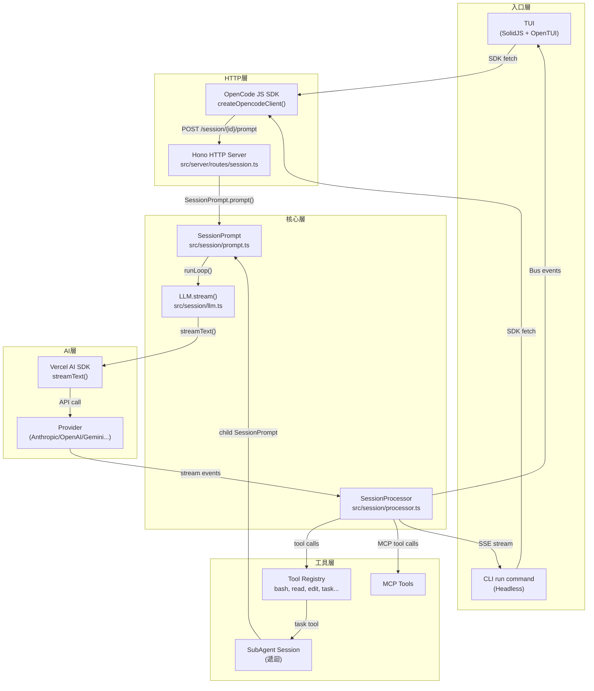
```mermaid
graph TD
    subgraph 入口層
        TUI["TUI<br/>(SolidJS + OpenTUI)"]
        CLI["CLI run command<br/>(Headless)"]
    end

    subgraph HTTP層
        SDK["OpenCode JS SDK<br/>createOpencodeClient()"]
        Server["Hono HTTP Server<br/>src/server/routes/session.ts"]
    end

    subgraph 核心層
        SP["SessionPrompt<br/>src/session/prompt.ts"]
        LLM["LLM.stream()<br/>src/session/llm.ts"]
        Proc["SessionProcessor<br/>src/session/processor.ts"]
    end

    subgraph AI層
        Vercel["Vercel AI SDK<br/>streamText()"]
        Provider["Provider<br/>(Anthropic/OpenAI/Gemini...)"]
    end

    subgraph 工具層
        Tools["Tool Registry<br/>bash, read, edit, task..."]
        MCP["MCP Tools"]
        Subagent["SubAgent Session<br/>(遞迴)"]
    end

    TUI -->|"SDK fetch"| SDK
    CLI -->|"SDK fetch"| SDK
    SDK -->|"POST /session/{id}/prompt"| Server
    Server -->|"SessionPrompt.prompt()"| SP
    SP -->|"runLoop()"| LLM
    LLM -->|"streamText()"| Vercel
    Vercel -->|"API call"| Provider
    Provider -->|"stream events"| Proc
    Proc -->|"tool calls"| Tools
    Proc -->|"MCP tool calls"| MCP
    Tools -->|"task tool"| Subagent
    Subagent -->|"child SessionPrompt"| SP

    Proc -->|"Bus events"| TUI
    Proc -->|"SSE stream"| CLI
```


---

## 入口層：TUI vs CLI

### TUI 路徑

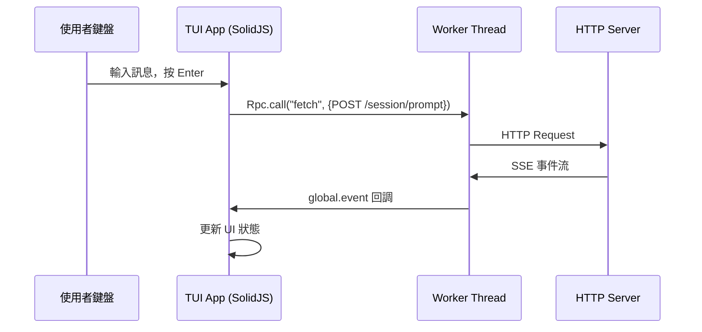
```mermaid
sequenceDiagram
    participant User as 使用者鍵盤
    participant TUI as TUI App (SolidJS)
    participant Worker as Worker Thread
    participant Server as HTTP Server

    User->>TUI: 輸入訊息，按 Enter
    TUI->>Worker: Rpc.call("fetch", {POST /session/prompt})
    Worker->>Server: HTTP Request
    Server->>Worker: SSE 事件流
    Worker->>TUI: global.event 回調
    TUI->>TUI: 更新 UI 狀態
```


**關鍵檔案：** `src/cli/cmd/tui/thread.ts`

TUI 啟動流程：

1. `TuiThreadCommand` 建立 Worker 子程序
2. 透過 `Rpc.client` 將所有 fetch 請求代理到 Worker（Worker 中執行真正的 Server）
3. SolidJS 組件透過 SDK 訂閱 `global.event` 事件串流
4. 使用者送出訊息 → `sdk.session.prompt()` → Worker → Server

### CLI run 路徑

**關鍵檔案：** `src/cli/cmd/run.ts`

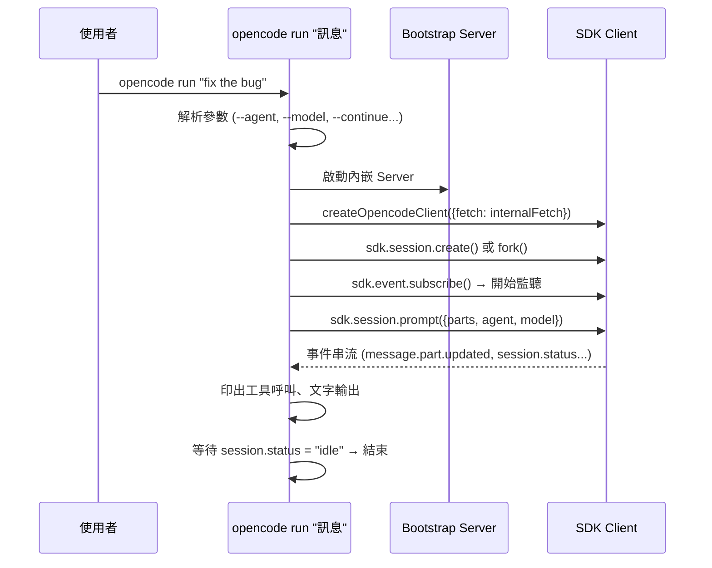
```mermaid
sequenceDiagram
    participant User as 使用者
    participant CLI as opencode run "訊息"
    participant Bootstrap as Bootstrap Server
    participant SDK as SDK Client

    User->>CLI: opencode run "fix the bug"
    CLI->>CLI: 解析參數 (--agent, --model, --continue...)
    CLI->>Bootstrap: 啟動內嵌 Server
    CLI->>SDK: createOpencodeClient({fetch: internalFetch})
    CLI->>SDK: sdk.session.create() 或 fork()
    CLI->>SDK: sdk.event.subscribe() → 開始監聽
    CLI->>SDK: sdk.session.prompt({parts, agent, model})
    SDK-->>CLI: 事件串流 (message.part.updated, session.status...)
    CLI->>CLI: 印出工具呼叫、文字輸出
    CLI->>CLI: 等待 session.status = "idle" → 結束
```


**CLI 的 Permission 規則（無互動模式）：**

```typescript
// src/cli/cmd/run.ts:362-378
const rules: Permission.Ruleset = [
  { permission: "question",   action: "deny", pattern: "*" }, // 不允許 AI 問使用者問題
  { permission: "plan_enter", action: "deny", pattern: "*" }, // 不允許進入 plan 模式
  { permission: "plan_exit",  action: "deny", pattern: "*" }, // 不允許退出 plan 模式
]
```

---

## HTTP 層：Session API

**關鍵檔案：** `src/server/routes/session.ts`

主要端點：


| 端點                           | 功能               |
| ---------------------------- | ---------------- |
| `POST /session`              | 建立新 session      |
| `POST /session/{id}/prompt`  | 送出使用者訊息並觸發 AI    |
| `POST /session/{id}/command` | 執行 slash command |
| `GET /session/status`        | SSE 事件流          |
| `POST /session/{id}/fork`    | 複製 session       |


`/prompt` 端點呼叫路徑：

```
POST /session/{id}/prompt
  → AppRuntime.run(SessionPrompt.Service)
  → sessionPrompt.prompt(input)
```

---

## 核心循環：SessionPrompt.runLoop

**關鍵檔案：** `src/session/prompt.ts:1297` — `runLoop()`

這是整個 AI 執行的心臟。每次迭代代表一個「步驟」(step)，包含一次完整的 LLM 呼叫。


```mermaid
flowchart TD
    Start([開始 runLoop]) --> SetBusy[status.set busy]
    SetBusy --> GetMsgs["msgs = filterCompactedEffect(sessionID)<br/>從 DB 取出未被壓縮的訊息"]
    GetMsgs --> Scan["往回掃描 msgs<br/>找出 lastUser / lastAssistant / lastFinished<br/>收集 tasks: subtask|compaction parts<br/>（只收 lastFinished 之前未完成的）"]

    Scan --> CheckExit{"lastAssistant.finish 存在<br/>且 finish != tool-calls<br/>且無未執行的 tool calls<br/>且 lastUser.id < lastAssistant.id ?"}
    CheckExit -->|是 → 正常完成| Done([退出 loop，返回最後訊息])
    CheckExit -->|否 → 繼續| StepInc["step++<br/>step===1 時 fork title 生成（背景）"]

    StepInc --> PopTask["task = tasks.pop()"]

    PopTask -->|task.type === subtask| HandleSubtask["handleSubtask()<br/>建立子 Agent Session 並執行<br/>→ continue"]
    HandleSubtask --> SetBusy

    PopTask -->|task.type === compaction| HandleCompact["compaction.process()<br/>壓縮歷史訊息"]
    HandleCompact -->|result === stop| Done2([退出 loop])
    HandleCompact -->|result !== stop → continue| SetBusy

    PopTask -->|task 為空| CheckOverflow{"lastFinished 存在<br/>且 token 超限<br/>且 summary !== true ?"}
    CheckOverflow -->|是| AutoCompact["compaction.create(auto=true)<br/>→ continue"]
    AutoCompact --> SetBusy

    CheckOverflow -->|否| MainPath["取得 agent 配置<br/>計算 isLastStep = step >= agent.steps"]
    MainPath --> InsertReminders["insertReminders()<br/>注入 plan system-reminder 或 build-switch"]
    InsertReminders --> CreateAssistMsg["建立 assistant message 並存 DB<br/>processor.create()"]
    CreateAssistMsg --> Parallel["並行準備：<br/>① resolveTools() 篩選可用工具<br/>② SystemPrompt.skills() + environment()<br/>③ instruction.system() 讀 AGENTS.md<br/>④ toModelMessagesEffect() 轉換訊息格式"]
    Parallel --> LLMCall["handle.process()<br/>→ LLM.stream() → streamText()"]
    LLMCall --> CheckOutcome{outcome?}

    CheckOutcome -->|structured output 完成| Done3([break，返回結果])
    CheckOutcome -->|result === stop<br/>或 blocked/error| Done4([break，返回結果])
    CheckOutcome -->|result === compact| CompactCreate["compaction.create(auto=true)<br/>→ continue"]
    CompactCreate --> SetBusy
    CheckOutcome -->|result === continue| SetBusy
```


---

## Prompt 組裝細節

### System Prompt 組裝順序

**關鍵檔案：** `src/session/llm.ts:106-131`

組裝發生在兩個地方，呼叫順序如下：

**第一步：`runLoop` 組裝 `input.system`（`src/session/prompt.ts:1464-1470`）**

```typescript
// 這裡的 system 是傳給 LLM.stream() 的 input.system
const [skills, env, instructions, modelMsgs] = await Effect.all([
  SystemPrompt.skills(agent),       // 可用 skills 列表
  SystemPrompt.environment(model),  // 工作目錄、平台、日期
  instruction.system(),             // AGENTS.md / CLAUDE.md 內容
  MessageV2.toModelMessagesEffect(msgs, model),
])
const system = [...env, ...(skills ? [skills] : []), ...instructions]
```

**第二步：`LLM.stream()` 將所有來源合併為 `system[0]`（`src/session/llm.ts:106-131`）**

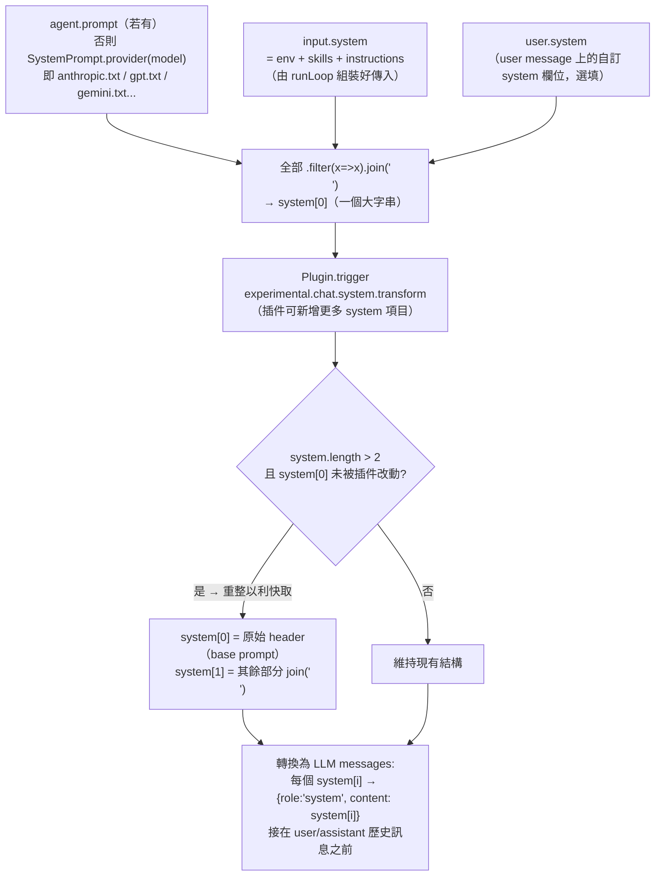
```mermaid
flowchart TD
    A["agent.prompt（若有）\n否則 SystemPrompt.provider(model)\n即 anthropic.txt / gpt.txt / gemini.txt..."]
    B["input.system\n= env + skills + instructions\n（由 runLoop 組裝好傳入）"]
    C["user.system\n（user message 上的自訂 system 欄位，選填）"]

    A --> Join
    B --> Join
    C --> Join

    Join["全部 .filter(x=>x).join('\n')\n→ system[0]（一個大字串）"]

    Join --> Plugin["Plugin.trigger\nexperimental.chat.system.transform\n（插件可新增更多 system 項目）"]

    Plugin --> CacheCheck{"system.length > 2\n且 system[0] 未被插件改動?"}
    CacheCheck -->|是 → 重整以利快取| Split["system[0] = 原始 header（base prompt）\nsystem[1] = 其餘部分 join('\n')"]
    CacheCheck -->|否| Final["維持現有結構"]

    Split --> Messages["轉換為 LLM messages:\n每個 system[i] → {role:'system', content: system[i]}\n接在 user/assistant 歷史訊息之前"]
    Final --> Messages
```


### 組裝完成後的完整 Prompt 範例

以下展示三種情境下實際送給 LLM 的完整訊息結構。

---

#### 情境一：Build Agent + Claude（正常執行，無 Plugin）

> 條件：`agent = build`、`model = claude-sonnet-4-6`、無 user.system、無 plugin 介入

```
╔══════════════════════════════════════════════════════════════════════╗
║  messages[0]  role: "system"                                         ║
║  來源：LLM.stream() system[0]（一切 join('\n') 後的大字串）          ║
╚══════════════════════════════════════════════════════════════════════╝

━━━ [區塊 1] Provider Base Prompt ━━━━━━━━━━━━━━━━━━━━━━━━━━━━━━━━━━━━
  來源：SystemPrompt.provider(model) → src/session/prompt/anthropic.txt
  （因為 build agent 無 agent.prompt，所以用 provider 判斷）

You are OpenCode, the best coding agent on the planet.

You are an interactive CLI tool that helps users with software engineering tasks.
Use the instructions below and the tools available to you to assist the user.

IMPORTANT: You must NEVER generate or guess URLs for the user unless you are
confident that the URLs are for helping the user with programming.
You may use URLs provided by the user in their messages or local files.

If the user asks for help or wants to give feedback inform them of the following:
- ctrl+p to list available actions
- To give feedback, users should report the issue at
  https://github.com/anomalyco/opencode

When the user directly asks about OpenCode (eg. "can OpenCode do..."), use the
WebFetch tool to gather information from OpenCode docs.
The list of available docs is available at https://opencode.ai/docs

# Tone and style
- Only use emojis if the user explicitly requests it.
- Your output will be displayed on a command line interface.
  Your responses should be short and concise.
- Output text to communicate with the user; all text you output outside of tool
  use is displayed to the user.
- NEVER create files unless they're absolutely necessary for achieving your goal.

# Professional objectivity
Prioritize technical accuracy and truthfulness over validating the user's beliefs.
...

# Task Management
You have access to the TodoWrite tools to help you manage and plan tasks.
Use these tools VERY frequently to ensure that you are tracking your tasks...

# Doing tasks
The user will primarily request you perform software engineering tasks.
...

# Tool usage policy
- When doing file search, prefer to use the Task tool in order to reduce context usage.
- You should proactively use the Task tool with specialized agents...
...

# Code References
When referencing specific functions or pieces of code include the pattern
`file_path:line_number` to allow the user to easily navigate to the source code.

━━━ [區塊 2] Environment Block ━━━━━━━━━━━━━━━━━━━━━━━━━━━━━━━━━━━━━━━
  來源：SystemPrompt.environment(model) → src/session/system.ts:36-61
  （這是 input.system[0]，由 runLoop 組裝後傳入）

You are powered by the model named claude-sonnet-4-6.
The exact model ID is anthropic/claude-sonnet-4-6
Here is some useful information about the environment you are running in:
<env>
  Working directory: /home/user/Project/myapp
  Workspace root folder: /home/user/Project/myapp
  Is directory a git repo: yes
  Platform: linux
  Today's date: Mon Apr 13 2026
</env>
<directories>
</directories>

━━━ [區塊 3] Skills Block ━━━━━━━━━━━━━━━━━━━━━━━━━━━━━━━━━━━━━━━━━━━
  來源：SystemPrompt.skills(agent) → src/session/system.ts:63-75
  （這是 input.system[1]，只有在 skill 工具未被 deny 時才有）

Skills provide specialized instructions and workflows for specific tasks.
Use the skill tool to load a skill when a task matches its description.

- commit: Use when committing code. Stages changes, writes conventional commit
  messages, and handles pre-commit hooks.
- review-pr: Use when reviewing pull requests. Checks diff, comments on issues,
  and summarizes changes.
- ...（其他已安裝的 skills）

━━━ [區塊 4] Instructions（AGENTS.md 內容）━━━━━━━━━━━━━━━━━━━━━━━━━━━
  來源：instruction.system() → src/session/instruction.ts:164-178
  （這是 input.system[2]，從專案目錄向上找 AGENTS.md / CLAUDE.md）

Instructions from: /home/user/Project/myapp/AGENTS.md
# Project Conventions
- Use Effect for all async operations
- Single-word variable names preferred
- No try/catch — use Effect.catch instead
...

╔══════════════════════════════════════════════════════════════════════╗
║  messages[1]  role: "user"                                           ║
║  來源：MessageV2.toModelMessagesEffect() 轉換歷史訊息                ║
╚══════════════════════════════════════════════════════════════════════╝

fix the bug in src/session/llm.ts where tokens are being double-counted

╔══════════════════════════════════════════════════════════════════════╗
║  messages[2]  role: "assistant"  （上一輪工具呼叫，第二步以後才有）  ║
╚══════════════════════════════════════════════════════════════════════╝

[tool_use: read, id: "tc_01", input: {filePath: "src/session/llm.ts"}]

╔══════════════════════════════════════════════════════════════════════╗
║  messages[3]  role: "user"  （工具結果）                             ║
╚══════════════════════════════════════════════════════════════════════╝

[tool_result: id: "tc_01", content: "...llm.ts 的檔案內容..."]
```

> **注意**：沒有 plugin 介入時，所有內容 join 成**單一 system 字串**送出（`system.length === 1`），不分兩段。

---

#### 情境二：Plan Agent（第一次進入 Plan 模式）

> 條件：`agent = plan`、第一次呼叫（尚無 plan 檔案）、`Flag.OPENCODE_EXPERIMENTAL_PLAN_MODE = true`

Plan agent 本身**沒有 `agent.prompt`**，所以 `system[0]` 的開頭和 build agent 完全相同（都是 anthropic.txt）。差別在於 `insertReminders()` 把 plan 指令注入到 **user message** 裡作為 synthetic text part，**不在 system prompt 中**。

```
╔══════════════════════════════════════════════════════════════════════╗
║  messages[0]  role: "system"                                         ║
╚══════════════════════════════════════════════════════════════════════╝

━━━ [區塊 1] Provider Base Prompt ━━━━━━━━━━━━━━━━━━━━━━━━━━━━━━━━━━━━
  （與 build agent 完全相同：anthropic.txt 全文）

You are OpenCode, the best coding agent on the planet.
...（同上）

━━━ [區塊 2] Environment Block ━━━━━━━━━━━━━━━━━━━━━━━━━━━━━━━━━━━━━━━
  （與 build agent 相同）

━━━ [區塊 3] Skills Block ━━━━━━━━━━━━━━━━━━━━━━━━━━━━━━━━━━━━━━━━━━━
  （與 build agent 相同，但 skill 工具若被 deny 則此區塊不存在）

━━━ [區塊 4] Instructions ━━━━━━━━━━━━━━━━━━━━━━━━━━━━━━━━━━━━━━━━━━━
  （與 build agent 相同：AGENTS.md 內容）

╔══════════════════════════════════════════════════════════════════════╗
║  messages[1]  role: "user"                                           ║
║  包含多個 parts，其中最後一個是 insertReminders() 注入的 synthetic   ║
╚══════════════════════════════════════════════════════════════════════╝

━━━ [part 1] 使用者原始訊息（type: text，非 synthetic）━━━━━━━━━━━━━
add a retry mechanism to the HTTP client

━━━ [part 2] Plan 工作流程指令（type: text，synthetic: true）━━━━━━━
  來源：insertReminders() → src/session/prompt.ts:260-343
  這個 part 由 system 注入，使用者看不到

<system-reminder>
Plan mode is active. The user indicated that they do not want you to execute yet
-- you MUST NOT make any edits (with the exception of the plan file mentioned
below), run any non-readonly tools (including changing configs or making commits),
or otherwise make any changes to the system. This supersedes any other
instructions you have received.

## Plan File Info:
No plan file exists yet. You should create your plan at
/home/user/.local/share/opencode/plans/01JRXYZ123.md using the write tool.
You should build your plan incrementally by writing to or editing this file.
NOTE that this is the only file you are allowed to edit.

## Plan Workflow

### Phase 1: Initial Understanding
Goal: Gain a comprehensive understanding of the user's request by reading through
code and asking them questions. Critical: In this phase you should only use the
explore subagent type.

1. Focus on understanding the user's request and the code associated with it
2. **Launch up to 3 explore agents IN PARALLEL** (single message, multiple calls)
   - Use 1 agent when the task is isolated to known files
   - Use multiple agents when scope is uncertain
3. After exploring, use the question tool to clarify ambiguities

### Phase 2: Design
Goal: Design an implementation approach.
Launch general agent(s) to design the implementation.
You can launch up to 1 agent(s) in parallel.

### Phase 3: Review
Goal: Review the plan(s) and ensure alignment with user's intentions.
1. Read the critical files identified by agents
2. Ensure plans align with original request
3. Use question tool to clarify remaining questions

### Phase 4: Final Plan
Goal: Write final plan to the plan file.
- Include only recommended approach
- Include paths of critical files to modify
- Include verification section

### Phase 5: Call plan_exit tool
At the very end, call plan_exit to indicate you are done planning.
Your turn should only end with asking a question or calling plan_exit.
</system-reminder>
```

---

#### 情境三：Explore Subagent（由 Task Tool 建立的子 Session）

> 條件：`agent = explore`，這是 plan agent 啟動的子 session

Explore agent **有 `agent.prompt`**（`src/agent/prompt/explore.txt`），所以 `system[0]` 的開頭**不是 anthropic.txt，而是 explore.txt**。

```
╔══════════════════════════════════════════════════════════════════════╗
║  messages[0]  role: "system"                                         ║
╚══════════════════════════════════════════════════════════════════════╝

━━━ [區塊 1] Agent-Specific Prompt ━━━━━━━━━━━━━━━━━━━━━━━━━━━━━━━━━━
  來源：agent.prompt → src/agent/prompt/explore.txt
  （因為 explore agent 有自己的 prompt，所以「取代」provider base prompt）

You are a file search specialist. You excel at thoroughly navigating
and exploring codebases.

Your strengths:
- Rapidly finding files using glob patterns
- Searching code and text with powerful regex patterns
- Reading and analyzing file contents

Guidelines:
- Use Glob for broad file pattern matching
- Use Grep for searching file contents with regex
- Use Read when you know the specific file path you need to read
- Use Bash for file operations like copying, moving, or listing directory contents
- Adapt your search approach based on the thoroughness level specified by the caller
- Return file paths as absolute paths in your final response
- For clear communication, avoid using emojis
- Do not create any files, or run bash commands that modify the user's system
  state in any way

Complete the user's search request efficiently and report your findings clearly.

━━━ [區塊 2] Environment Block ━━━━━━━━━━━━━━━━━━━━━━━━━━━━━━━━━━━━━━━
  （與主 agent 相同，子 session 也有完整 env context）

━━━ [區塊 3] Skills Block ━━━━━━━━━━━━━━━━━━━━━━━━━━━━━━━━━━━━━━━━━━━
  （explore agent 的 permission 允許 skill 工具，所以有此區塊）

━━━ [區塊 4] Instructions ━━━━━━━━━━━━━━━━━━━━━━━━━━━━━━━━━━━━━━━━━━━
  （AGENTS.md 內容，子 session 同樣載入）

╔══════════════════════════════════════════════════════════════════════╗
║  messages[1]  role: "user"                                           ║
║  來源：task tool 的 prompt 參數，由父 agent 填寫                     ║
╚══════════════════════════════════════════════════════════════════════╝

━━━ [part 1] 父 Session 的最後訊息摘要（TaskTool 自動加入）━━━━━━━━━

<context>
Parent session context: The user wants to add a retry mechanism to the HTTP client.
We are in planning phase.
</context>

━━━ [part 2] 任務描述（task tool 的 prompt 參數）━━━━━━━━━━━━━━━━━━━

Find all files related to the HTTP client in this codebase. Look for:
1. The main HTTP client implementation
2. Any existing retry or error handling patterns
3. Where the HTTP client is used
Thoroughness: medium
```

---

#### 情境四：Plan → Build 切換（第一次執行 Build）

> 條件：session 歷史中有 plan agent 的回覆，現在切換到 build agent

```
╔══════════════════════════════════════════════════════════════════════╗
║  messages[0]  role: "system"  （與情境一完全相同）                   ║
╚══════════════════════════════════════════════════════════════════════╝

━━━ [區塊 1-4] 與 build agent 相同 ━━━━━━━━━━━━━━━━━━━━━━━━━━━━━━━━━━

╔══════════════════════════════════════════════════════════════════════╗
║  messages[1..N]  歷史訊息（Plan 階段的所有對話）                    ║
╚══════════════════════════════════════════════════════════════════════╝

role: user    → add a retry mechanism to the HTTP client
              + <system-reminder>Plan mode is active...</system-reminder>  ← synthetic
role: assistant → [task tool calls to explore agents...]
role: user    → [tool results from explore agents...]
role: assistant → [plan_exit tool call]
role: user    → [plan_exit result: 使用者確認執行]

╔══════════════════════════════════════════════════════════════════════╗
║  messages[N+1]  role: "user"  （切換到 build 後的第一個 user msg）  ║
╚══════════════════════════════════════════════════════════════════════╝

━━━ [part 1] 使用者訊息（原始或空，視情況）━━━━━━━━━━━━━━━━━━━━━━━━
（可能是使用者按下「Execute Plan」，無新文字）

━━━ [part 2] Build-Switch 提醒（synthetic: true）━━━━━━━━━━━━━━━━━━━
  來源：insertReminders() → src/session/prompt/build-switch.txt
  + Plan 檔案路徑提示（OPENCODE_EXPERIMENTAL_PLAN_MODE 開啟時）

<system-reminder>
Your operational mode has changed from plan to build.
You are no longer in read-only mode.
You are permitted to make file changes, run shell commands,
and utilize your arsenal of tools as needed.
</system-reminder>

A plan file exists at /home/user/.local/share/opencode/plans/01JRXYZ123.md.
You should execute on the plan defined within it
```

---

### 各情境 System Prompt 差異對照


|                   | build agent                     | plan agent           | explore subagent  |
| ----------------- | ------------------------------- | -------------------- | ----------------- |
| 區塊 1 來源           | `anthropic.txt`                 | `anthropic.txt`（同上）  | `explore.txt`（取代） |
| 區塊 2 env          | ✓                               | ✓                    | ✓                 |
| 區塊 3 skills       | ✓（有 skill 工具）                   | ✓                    | ✓                 |
| 區塊 4 instructions | ✓ AGENTS.md                     | ✓ AGENTS.md          | ✓ AGENTS.md       |
| Plan 工作流程         | ✗                               | **user message** 中注入 | ✗                 |
| Build-switch      | ✗                               | ✗                    | ✗                 |
| Build-switch 出現   | plan→build 切換時 user message 中注入 | ✗                    | ✗                 |


> **核心規律**：system prompt 本體各 agent 幾乎相同；**agent 行為差異主要靠 permission 規則限制工具**，以及在 **user message 注入 synthetic text parts** 來改變 AI 的行為模式，而非靠不同的 system prompt。

---

### Provider 特定 Base Prompt 選擇

**關鍵檔案：** `src/session/system.ts:20-33`

```typescript
export function provider(model: Provider.Model) {
  if (model.api.id.includes("gpt-4") || model.api.id.includes("o1") || ...)
    return [PROMPT_BEAST]     // src/session/prompt/beast.txt
  if (model.api.id.includes("gpt"))
    return [PROMPT_GPT]       // src/session/prompt/gpt.txt
  if (model.api.id.includes("gemini-"))
    return [PROMPT_GEMINI]    // src/session/prompt/gemini.txt
  if (model.api.id.includes("claude"))
    return [PROMPT_ANTHROPIC] // src/session/prompt/anthropic.txt
  ...
  return [PROMPT_DEFAULT]     // src/session/prompt/default.txt
}
```

### Environment Block 內容

**關鍵檔案：** `src/session/system.ts:36-61`

```
You are powered by the model named claude-sonnet-4-6. The exact model ID is anthropic/claude-sonnet-4-6
Here is some useful information about the environment you are running in:
<env>
  Working directory: /home/user/Project/myapp
  Workspace root folder: /home/user/Project/myapp
  Is directory a git repo: yes
  Platform: linux
  Today's date: Sun Apr 13 2026
</env>
```

### Instructions（AGENTS.md / CLAUDE.md）載入

**關鍵檔案：** `src/session/instruction.ts`

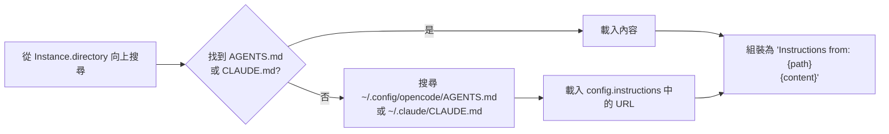
```mermaid
flowchart LR
    A["從 Instance.directory 向上搜尋"] --> B{找到 AGENTS.md<br/>或 CLAUDE.md?}
    B -->|是| C["載入內容"]
    B -->|否| D["搜尋 ~/.config/opencode/AGENTS.md<br/>或 ~/.claude/CLAUDE.md"]
    D --> E["載入 config.instructions 中的 URL"]
    C --> F["組裝為 'Instructions from: {path}\n{content}'"]
    E --> F
```


**Read 工具觸發的 inline 載入（`src/session/instruction.ts:187-229`）：**

當 AI 讀取某個檔案時，系統會自動搜尋該檔案目錄及其父目錄中的 instruction 檔案，並附加到後續訊息中（每個 assistant message 只附加一次）。

### Skills 系統

**關鍵檔案：** `src/session/system.ts:63-75`

```typescript
export async function skills(agent: Agent.Info) {
  const list = await Skill.available(agent)
  return [
    "Skills provide specialized instructions and workflows for specific tasks.",
    "Use the skill tool to load a skill when a task matches its description.",
    Skill.fmt(list, { verbose: true }), // 詳細格式的 skills 清單
  ].join("\n")
}
```

---

## Plan 模式：完整流程

### Agent 定義

**關鍵檔案：** `src/agent/agent.ts:123-146`

```typescript
plan: {
  name: "plan",
  description: "Plan mode. Disallows all edit tools.",
  permission: Permission.merge(
    defaults,
    Permission.fromConfig({
      question: "allow",        // 可以問使用者問題
      plan_exit: "allow",       // 可以退出 plan 模式
      external_directory: {
        [path.join(Global.Path.data, "plans", "*")]: "allow",
      },
      edit: {
        "*": "deny",                               // 禁止所有 edit
        [path.join(".opencode", "plans", "*.md")]: "allow", // 只允許編輯 plan 檔案
        [path.join(Global.Path.data, "plans", "*.md")]: "allow",
      },
    }),
    user,
  ),
  mode: "primary",
  native: true,
}
```

### Plan 模式 System Prompt 注入

**關鍵檔案：** `src/session/prompt.ts:218-343` — `insertReminders()`

當 `agent.name === "plan"` 時，在最後一個 user message 中注入以下內容（作為 synthetic text part）：

```markdown
<system-reminder>
Plan mode is active. The user indicated that they do not want you to execute yet --
you MUST NOT make any edits (with the exception of the plan file mentioned below),
run any non-readonly tools, or otherwise make any changes to the system.

## Plan File Info:
A plan file already exists at .opencode/plans/{sessionID}.md (或提示建立新的)
You should build your plan incrementally by writing to or editing this file.
NOTE that this is the only file you are allowed to edit - other than this you are only allowed to take READ-ONLY actions.

## Plan Workflow

### Phase 1: Initial Understanding
Goal: Gain a comprehensive understanding of the user's request

1. Focus on understanding the user's request and the code associated with their request
2. **Launch up to 3 explore agents IN PARALLEL** (single message, multiple tool calls)
   - Use 1 agent when the task is isolated to known files
   - Use multiple agents when scope is uncertain or multiple areas involved
   - Quality over quantity - 3 agents maximum

3. After exploring the code, use the question tool to clarify ambiguities

### Phase 2: Design
Goal: Design an implementation approach.
Launch general agent(s) to design the implementation.
Can launch up to 1 agent(s) in parallel.

### Phase 3: Review
Goal: Review the plan(s) and ensure alignment with user's intentions.
1. Read critical files to deepen understanding
2. Ensure plans align with original request
3. Use question tool for remaining questions

### Phase 4: Final Plan
Goal: Write final plan to plan file (the ONLY file you can edit).
- Include only recommended approach, not all alternatives
- Include paths of critical files to modify
- Include verification section for testing

### Phase 5: Call plan_exit tool
At the very end - call plan_exit to indicate planning is done.
Your turn should only end with either asking a question or calling plan_exit.
</system-reminder>
```

### Plan 模式可用工具一覽

Plan agent 的 permission 繼承自 `defaults`（`"*": "allow"`），再限制 edit 為唯讀。因此以下工具全部可用：


| 工具                                | 來源                  | 說明                                          |
| --------------------------------- | ------------------- | ------------------------------------------- |
| `glob` / `grep` / `read` / `list` | 本地 Filesystem       | 搜尋與讀取專案檔案                                   |
| `bash`                            | 本地 Shell            | 執行唯讀命令（`git log`, `cat`, `find`...）         |
| `webfetch`                        | 外部 HTTP             | 抓取指定 URL，HTML 自動轉 Markdown（TurndownService） |
| `websearch`                       | Exa Search API      | 全網搜尋，返回帶摘要的結果列表                             |
| `codesearch`                      | Exa Code Search API | 搜尋程式碼範例、API 文件、SDK 用法                       |
| `task`                            | 子 Session           | 啟動 explore / general subagent               |
| `question`                        | Permission Bus      | 向使用者提問，等待回答                                 |
| `write`                           | Filesystem          | **只允許寫入 plan 檔案**（其他 path 被 deny）           |
| `edit`                            | Filesystem          | **只允許 edit plan 檔案**（精準局部替換，非全覆蓋）           |
| `plan_exit`                       | Permission Bus      | 宣告 plan 完成，觸發 build 切換提示                    |


> **Explore subagent** 的工具清單與 plan agent 幾乎相同（glob/grep/list/bash/read/webfetch/websearch/codesearch），但**明確禁止所有寫入操作**（permission `"*": "deny"` 再個別 allow 上列工具）。

---

### Plan 流程完整時序圖（含外部來源）

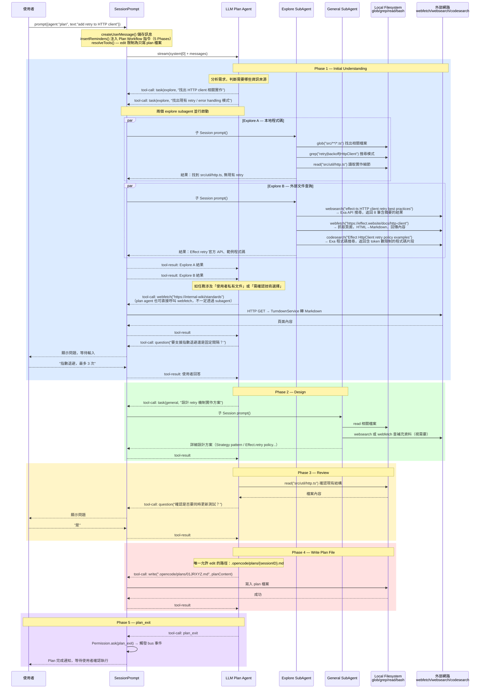
```mermaid
sequenceDiagram
    participant U as 使用者
    participant SP as SessionPrompt
    participant LLM as LLM Plan Agent
    participant Explore as Explore SubAgent
    participant General as General SubAgent
    participant FS as Local Filesystem<br/>glob/grep/read/bash
    participant Web as 外部網路<br/>webfetch/websearch/codesearch

    U->>SP: prompt({agent:"plan", text:"add retry to HTTP client"})
    Note over SP: createUserMessage() 儲存訊息<br/>insertReminders() 注入 Plan Workflow 指令（5 Phases）<br/>resolveTools() — edit 限制為只寫 plan 檔案

    SP->>LLM: stream(system[0] + messages)

    rect rgb(220, 235, 255)
        Note over LLM,Web: Phase 1 — Initial Understanding
        Note over LLM: 分析需求，判斷需要哪些資訊來源

        LLM-->>SP: tool-call: task(explore, "找出 HTTP client 相關實作")
        LLM-->>SP: tool-call: task(explore, "找出現有 retry / error handling 模式")
        Note over LLM,SP: 兩個 explore subagent 並行啟動

        par Explore A — 本地程式碼
            SP->>Explore: 子 Session prompt()
            Explore->>FS: glob("src/**/*.ts") 找出相關檔案
            Explore->>FS: grep("retry|backoff|HttpClient") 搜尋模式
            Explore->>FS: read("src/util/http.ts") 讀取實作細節
            Explore-->>SP: 結果：找到 src/util/http.ts, 無現有 retry
        end

        par Explore B — 外部文件查詢
            SP->>Explore: 子 Session prompt()
            Explore->>Web: websearch("effect-ts HTTP client retry best practices")<br/>→ Exa API 搜尋，返回 8 筆含摘要的結果
            Explore->>Web: webfetch("https://effect.website/docs/http-client")<br/>→ 抓取頁面，HTML→Markdown，回傳內容
            Explore->>Web: codesearch("Effect HttpClient retry policy examples")<br/>→ Exa 程式碼搜尋，返回含 token 數限制的程式碼片段
            Explore-->>SP: 結果：Effect retry 官方 API、範例程式碼
        end

        SP-->>LLM: tool-result: Explore A 結果
        SP-->>LLM: tool-result: Explore B 結果

        Note over LLM: 如任務涉及「使用者私有文件」或「需確認技術選擇」
        LLM-->>SP: tool-call: webfetch("https://internal-wiki/standards")<br/>（plan agent 也可直接呼叫 webfetch，不一定透過 subagent）
        SP->>Web: HTTP GET → TurndownService 轉 Markdown
        Web-->>SP: 頁面內容
        SP-->>LLM: tool-result

        LLM-->>SP: tool-call: question("要支援指數退避還是固定間隔？")
        SP-->>U: 顯示問題，等待輸入
        U-->>SP: "指數退避，最多 3 次"
        SP-->>LLM: tool-result: 使用者回答
    end

    rect rgb(220, 255, 220)
        Note over LLM,General: Phase 2 — Design
        LLM-->>SP: tool-call: task(general, "設計 retry 機制實作方案")
        SP->>General: 子 Session prompt()
        General->>FS: read 相關檔案
        General->>Web: websearch 或 webfetch 查補充資料（視需要）
        General-->>SP: 詳細設計方案（Strategy pattern / Effect.retry policy...）
        SP-->>LLM: tool-result
    end

    rect rgb(255, 245, 200)
        Note over LLM,FS: Phase 3 — Review
        LLM->>FS: read("src/util/http.ts") 確認現有結構
        FS-->>LLM: 檔案內容
        LLM-->>SP: tool-call: question("確認是否要同時更新測試？")
        SP-->>U: 顯示問題
        U-->>SP: "是"
        SP-->>LLM: tool-result
    end

    rect rgb(255, 225, 225)
        Note over LLM,FS: Phase 4 — Write Plan File
        Note over LLM: 唯一允許 edit 的路徑：.opencode/plans/{sessionID}.md
        LLM-->>SP: tool-call: write(".opencode/plans/01JRXYZ.md", planContent)
        SP->>FS: 寫入 plan 檔案
        FS-->>SP: 成功
        SP-->>LLM: tool-result
    end

    rect rgb(235, 220, 255)
        Note over LLM,U: Phase 5 — plan_exit
        LLM-->>SP: tool-call: plan_exit
        SP->>SP: Permission.ask(plan_exit) → 觸發 bus 事件
        SP-->>U: Plan 完成通知，等待使用者確認執行
    end
```


### webfetch / websearch / codesearch 三者差異


|               | webfetch               | websearch                 | codesearch               |
| ------------- | ---------------------- | ------------------------- | ------------------------ |
| 工具檔案          | `src/tool/webfetch.ts` | `src/tool/websearch.ts`   | `src/tool/codesearch.ts` |
| 後端            | 直接 HTTP GET            | Exa Search API            | Exa Search API（code 模式）  |
| 輸入            | URL                    | 自然語言查詢                    | 自然語言查詢（偏程式碼）             |
| 輸出格式          | 單頁完整內容（HTML→Markdown）  | 多筆結果 + 摘要（含 livecrawl 選項） | 多筆程式碼片段（token 數可控）       |
| 典型用途          | 讀取已知文件頁面、API spec      | 搜尋不知道 URL 的主題             | 找第三方 SDK 使用範例            |
| permission id | `webfetch`             | `websearch`               | `codesearch`             |


---

### Plan 檔案的修改方式：write vs edit

Plan agent 對 plan 檔案有兩種修改工具，行為完全不同。

**關鍵檔案：** `src/tool/write.ts`、`src/tool/edit.ts`

#### `write` 工具 — 全覆蓋

```
參數：{ filePath, content }
行為：將 content 完整寫入檔案，原有內容全部被取代
用途：plan 檔案不存在時初次建立，或需要完全重寫整份計畫時
```

```
write(".opencode/plans/01JRX.md", "# Plan\n## 步驟一\n...")
→ 整個檔案被 content 取代（fs.writeWithDirs 全覆蓋）
→ 寫入後執行 format.file()（程式碼格式化）
→ 發布 File.Event.Edited + FileWatcher.Event.Updated
→ LSP 檢查是否有 diagnostics
```

#### `edit` 工具 — 精準局部替換

```
參數：{ filePath, oldString, newString, replaceAll? }
行為：在檔案中找到 oldString 並替換為 newString，其餘內容不動
```

這是 edit 工具的核心，不是單純的字串搜尋。當 AI 提供的 `oldString` 和檔案實際內容有輕微差異時（縮排不同、空白不同、換行風格不同...），edit 工具會依序嘗試 **9 種 Replacer** 來容錯匹配：

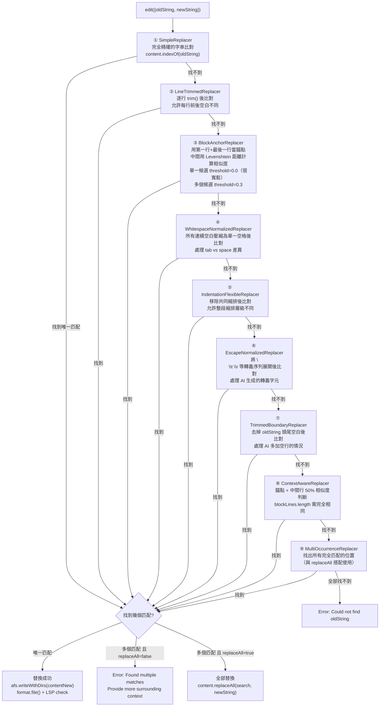
```mermaid
flowchart TD
    Input["edit({oldString, newString})"] --> R1

    R1["① SimpleReplacer\n完全精確的字串比對\ncontent.indexOf(oldString)"]
    R1 -->|找到唯一匹配| Replace
    R1 -->|找不到| R2

    R2["② LineTrimmedReplacer\n逐行 trim() 後比對\n允許每行前後空白不同"]
    R2 -->|找到| Replace
    R2 -->|找不到| R3

    R3["③ BlockAnchorReplacer\n用第一行+最後一行當錨點\n中間用 Levenshtein 距離計算相似度\n單一候選 threshold=0.0（很寬鬆）\n多個候選 threshold=0.3"]
    R3 -->|找到| Replace
    R3 -->|找不到| R4

    R4["④ WhitespaceNormalizedReplacer\n所有連續空白壓縮為單一空格後比對\n處理 tab vs space 差異"]
    R4 -->|找到| Replace
    R4 -->|找不到| R5

    R5["⑤ IndentationFlexibleReplacer\n移除共同縮排後比對\n允許整段縮排層級不同"]
    R5 -->|找到| Replace
    R5 -->|找不到| R6

    R6["⑥ EscapeNormalizedReplacer\n將 \\n \\t \\r 等轉義序列展開後比對\n處理 AI 生成的轉義字元"]
    R6 -->|找到| Replace
    R6 -->|找不到| R7

    R7["⑦ TrimmedBoundaryReplacer\n去掉 oldString 頭尾空白後比對\n處理 AI 多加空行的情況"]
    R7 -->|找到| Replace
    R7 -->|找不到| R8

    R8["⑧ ContextAwareReplacer\n錨點 + 中間行 50% 相似度判斷\nblockLines.length 需完全相同"]
    R8 -->|找到| Replace
    R8 -->|找不到| R9

    R9["⑨ MultiOccurrenceReplacer\n找出所有完全匹配的位置\n（與 replaceAll 搭配使用）"]
    R9 -->|找到| Replace
    R9 -->|全部找不到| Err1["Error: Could not find oldString"]

    Replace{"找到幾個匹配?"}
    Replace -->|唯一匹配| Apply["替換成功\nafs.writeWithDirs(contentNew)\nformat.file() + LSP check"]
    Replace -->|多個匹配 且 replaceAll=false| Err2["Error: Found multiple matches\nProvide more surrounding context"]
    Replace -->|多個匹配 且 replaceAll=true| ApplyAll["全部替換\ncontent.replaceAll(search, newString)"]
```


**edit 工具的安全機制（`src/tool/edit.ts:103`）：**

```typescript
yield* filetime.assert(ctx.sessionID, filePath)
```

每次 edit 前會斷言：自從這個 session 最後一次讀取此檔案後，該檔案沒有被外部程式修改過。若有衝突則報錯，防止覆蓋使用者手動的修改。

`**oldString === ""` 的特殊行為：**

```typescript
if (params.oldString === "") {
  // 不讀現有檔案，直接寫入 newString（建立新檔或追加內容的替代用法）
  yield* afs.writeWithDirs(filePath, params.newString)
}
```

#### 實際使用模式（Plan 檔案）

```
Phase 4 初次建立：
  AI 呼叫 write(planPath, 完整 markdown 內容)
  → 全覆蓋，建立新 plan 檔案

Phase 3 審查後微調：
  AI 呼叫 edit(planPath, oldString="## 步驟二\n舊描述", newString="## 步驟二\n新描述")
  → 只改那一段，其餘不動

Phase 3 使用者問答後補充：
  AI 呼叫 edit(planPath, oldString="## 驗證", newString="## 驗證\n- 同時更新測試：是")
  → 在特定位置插入新內容
```

---

## Build 模式：完整流程

### Agent 定義

**關鍵檔案：** `src/agent/agent.ts:108-122`

```typescript
build: {
  name: "build",
  description: "The default agent. Executes tools based on configured permissions.",
  permission: Permission.merge(
    defaults,
    Permission.fromConfig({
      question: "allow",    // 可以問使用者問題
      plan_enter: "allow",  // 可以進入 plan 模式
    }),
    user,
  ),
  mode: "primary",
  native: true,
}
```

**預設 permissions（`src/agent/agent.ts:86-103`）：**

```typescript
const defaults = Permission.fromConfig({
  "*": "allow",              // 預設允許所有工具
  doom_loop: "ask",          // 偵測到循環時需確認
  external_directory: { "*": "ask" }, // 外部目錄需確認
  question: "deny",          // 預設不允許 AI 問問題
  plan_enter: "deny",
  plan_exit: "deny",
  read: {
    "*": "allow",
    "*.env": "ask",   // 敏感 env 檔案需確認
    "*.env.*": "ask",
    "*.env.example": "allow",
  },
})
```

### Plan → Build 切換

**關鍵檔案：** `src/session/prompt.ts:229-239`

當 session 中曾經出現 plan agent 的回覆，且現在切換到 build agent 時，在 user message 中注入：

`**src/session/prompt/build-switch.txt` 內容：**

```
<system-reminder>
Your operational mode has changed from plan to build.
You are no longer in read-only mode.
You are permitted to make file changes, run shell commands,
and utilize your arsenal of tools as needed.
</system-reminder>
```

同時（實驗性 plan mode 下）注入：

```
A plan file exists at {plan}. You should execute on the plan defined within it
```

### Build 執行流程（帶 Multi-Agent）

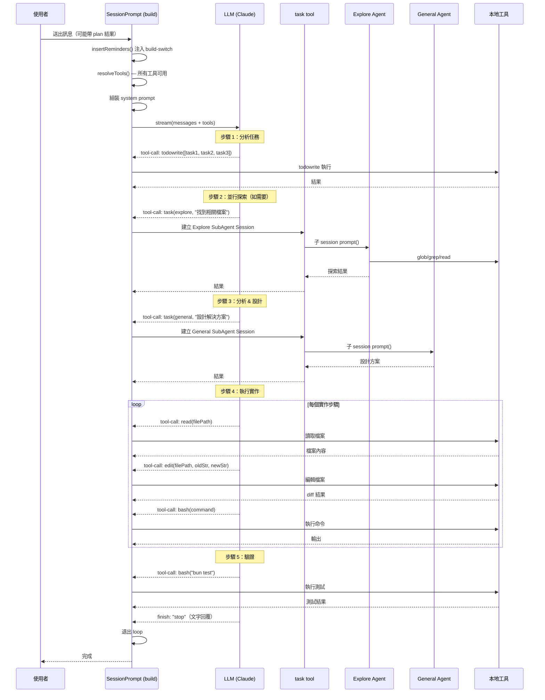
```mermaid
sequenceDiagram
    participant U as 使用者
    participant SP as SessionPrompt (build)
    participant LLM as LLM (Claude)
    participant Task as task tool
    participant ExploreA as Explore Agent
    participant GenA as General Agent
    participant Tools as 本地工具

    U->>SP: 送出訊息（可能帶 plan 結果）

    SP->>SP: insertReminders() 注入 build-switch
    SP->>SP: resolveTools() — 所有工具可用
    SP->>SP: 組裝 system prompt

    SP->>LLM: stream(messages + tools)

    Note over LLM: 步驟 1：分析任務

    LLM-->>SP: tool-call: todowrite([task1, task2, task3])
    SP->>Tools: todowrite 執行
    Tools-->>SP: 結果

    Note over LLM: 步驟 2：並行探索（如需要）

    LLM-->>SP: tool-call: task(explore, "找到相關檔案")
    SP->>Task: 建立 Explore SubAgent Session
    Task->>ExploreA: 子 session prompt()
    ExploreA->>Tools: glob/grep/read
    ExploreA-->>Task: 探索結果
    Task-->>SP: 結果

    Note over LLM: 步驟 3：分析 & 設計

    LLM-->>SP: tool-call: task(general, "設計解決方案")
    SP->>Task: 建立 General SubAgent Session
    Task->>GenA: 子 session prompt()
    GenA-->>Task: 設計方案
    Task-->>SP: 結果

    Note over LLM: 步驟 4：執行實作

    loop 每個實作步驟
        LLM-->>SP: tool-call: read(filePath)
        SP->>Tools: 讀取檔案
        Tools-->>SP: 檔案內容

        LLM-->>SP: tool-call: edit(filePath, oldStr, newStr)
        SP->>Tools: 編輯檔案
        Tools-->>SP: diff 結果

        LLM-->>SP: tool-call: bash(command)
        SP->>Tools: 執行命令
        Tools-->>SP: 輸出
    end

    Note over LLM: 步驟 5：驗證

    LLM-->>SP: tool-call: bash("bun test")
    SP->>Tools: 執行測試
    Tools-->>SP: 測試結果

    LLM-->>SP: finish: "stop"（文字回覆）
    SP->>SP: 退出 loop
    SP-->>U: 完成
```


---

## Multi-Agent 協作機制

### Task Tool 詳解

**關鍵檔案：** `src/tool/task.ts`

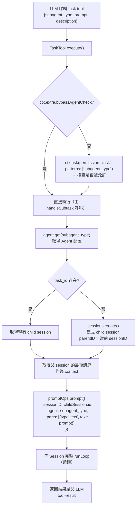
```mermaid
flowchart TD
    A["LLM 呼叫 task tool<br/>{subagent_type, prompt, description}"] -->
    B["TaskTool.execute()"]

    B --> C{ctx.extra.bypassAgentCheck?}
    C -->|否| D["ctx.ask(permission: 'task', patterns: [subagent_type])<br/>→ 檢查是否被允許"]
    C -->|是| E["直接執行（由 handleSubtask 呼叫）"]
    D --> E

    E --> F["agent.get(subagent_type)<br/>取得 Agent 配置"]
    F --> G{task_id 存在?}
    G -->|是| H["取得現有 child session"]
    G -->|否| I["sessions.create()<br/>建立 child session<br/>parentID = 當前 sessionID"]

    H --> J["取得父 session 的最後訊息<br/>作為 context"]
    I --> J

    J --> K["promptOps.prompt({<br/>  sessionID: childSession.id,<br/>  agent: subagent_type,<br/>  parts: [{type:'text', text: prompt}]<br/>})"]

    K --> L["子 Session 完整 runLoop<br/>（遞迴）"]

    L --> M["返回結果給父 LLM<br/>tool-result"]
```


**Task Tool 的 `task_id` 機制（`src/tool/task.ts`）：**

```typescript
// 如果有 task_id，繼續使用舊的子 session（保留上下文）
const session = taskID
  ? await sessions.get(SessionID.make(taskID))
  : undefined

// 否則建立新的 child session
const nextSession = session ?? await sessions.create({
  parentID: ctx.sessionID,
  title: params.description + ` (@${next.name} subagent)`,
})
```

這讓 LLM 可以「恢復」先前的子任務，保留 context。

### Agent 類型與權限矩陣


| Agent        | mode             | 允許工具                                            | 禁止工具      | 用途            |
| ------------ | ---------------- | ----------------------------------------------- | --------- | ------------- |
| `build`      | primary          | 全部                                              | -         | 預設主要 agent    |
| `plan`       | primary          | read/glob/grep/task(explore)/question/plan_exit | edit(大部分) | 規劃模式          |
| `general`    | subagent         | 全部                                              | todowrite | 通用多步驟任務       |
| `explore`    | subagent         | read/glob/grep/bash/webfetch/websearch          | 所有寫入工具    | 快速探索程式碼       |
| `compaction` | primary (hidden) | 無                                               | 全部        | 壓縮長對話         |
| `title`      | primary (hidden) | 無                                               | 全部        | 生成 session 標題 |


### Subtask 建立機制（`handleSubtask`）

**關鍵檔案：** `src/session/prompt.ts:516-706`

除了 LLM 透過 task tool 呼叫外，還有一個更直接的機制：

當 user message 中含有 `subtask` 類型的 part（由 ACP 協議或特殊指令觸發），`runLoop` 會在主 LLM 回覆之前先執行 subtask：

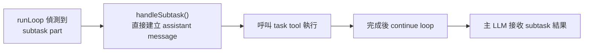
```mermaid
flowchart LR
    A["runLoop 偵測到<br/>subtask part"] -->
    B["handleSubtask()<br/>直接建立 assistant message"] -->
    C["呼叫 task tool 執行"] -->
    D["完成後 continue loop"] -->
    E["主 LLM 接收 subtask 結果"]
```


---

## 事件系統與 UI 更新

### Bus 事件流

**關鍵檔案：** `src/bus.ts`, `src/session/processor.ts`

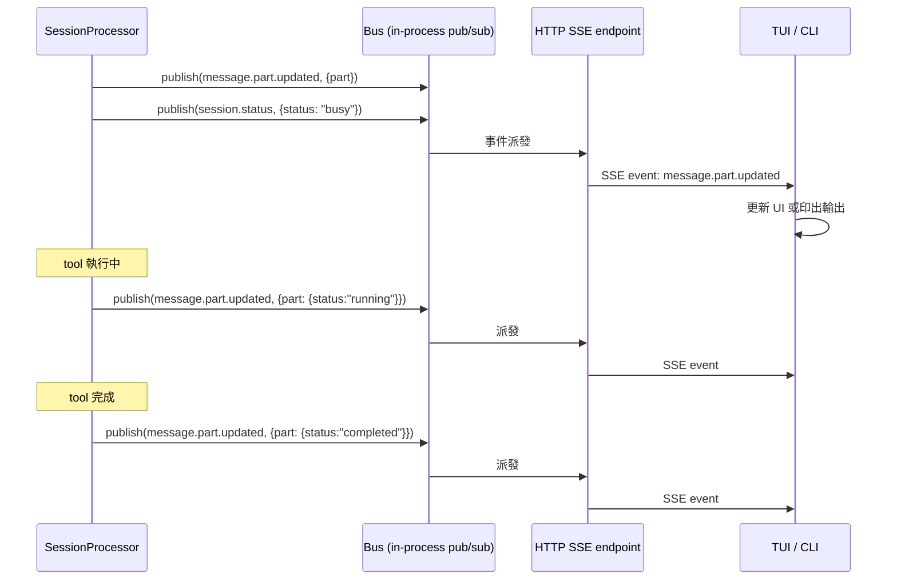
```mermaid
sequenceDiagram
    participant Proc as SessionProcessor
    participant Bus as Bus (in-process pub/sub)
    participant Server as HTTP SSE endpoint
    participant Client as TUI / CLI

    Proc->>Bus: publish(message.part.updated, {part})
    Proc->>Bus: publish(session.status, {status: "busy"})

    Bus->>Server: 事件派發
    Server->>Client: SSE event: message.part.updated
    Client->>Client: 更新 UI 或印出輸出

    Note over Proc: tool 執行中
    Proc->>Bus: publish(message.part.updated, {part: {status:"running"}})
    Bus->>Server: 派發
    Server->>Client: SSE event

    Note over Proc: tool 完成
    Proc->>Bus: publish(message.part.updated, {part: {status:"completed"}})
    Bus->>Server: 派發
    Server->>Client: SSE event
```


### CLI 的事件處理（`src/cli/cmd/run.ts:449-570`）

```typescript
for await (const event of events.stream) {
  // 文字輸出
  if (event.type === "message.part.updated" && part.type === "text" && part.time?.end) {
    UI.println(part.text)
  }
  // 工具呼叫（顯示圖示 + 標題）
  if (event.type === "message.part.updated" && part.type === "tool" && status === "completed") {
    tool(part) // → bash/glob/grep/read/write/edit/task...
  }
  // session 結束
  if (event.type === "session.status" && status.type === "idle") {
    break // 退出監聽
  }
  // permission 請求（CLI 自動拒絕）
  if (event.type === "permission.asked") {
    await sdk.permission.reply({ requestID: id, reply: "reject" })
  }
}
```

### LLM Stream 事件處理（`src/session/processor.ts:214-455`）

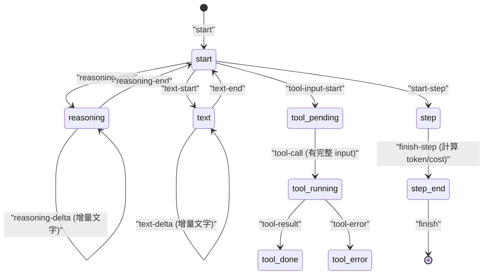
```mermaid
stateDiagram-v2
    [*] --> start : "start"
    start --> reasoning : "reasoning-start"
    reasoning --> reasoning : "reasoning-delta (增量文字)"
    reasoning --> start : "reasoning-end"

    start --> text : "text-start"
    text --> text : "text-delta (增量文字)"
    text --> start : "text-end"

    start --> tool_pending : "tool-input-start"
    tool_pending --> tool_running : "tool-call (有完整 input)"
    tool_running --> tool_done : "tool-result"
    tool_running --> tool_error : "tool-error"

    start --> step : "start-step"
    step --> step_end : "finish-step (計算 token/cost)"
    step_end --> [*] : "finish"
```


---

## 關鍵檔案索引


| 檔案                                    | 職責                                                                                 |
| ------------------------------------- | ---------------------------------------------------------------------------------- |
| `src/cli/cmd/tui/thread.ts`           | TUI 入口，Worker 代理，SolidJS app 初始化                                                   |
| `src/cli/cmd/run.ts`                  | CLI `run` 指令，headless 執行模式                                                         |
| `src/session/prompt.ts`               | 核心：`SessionPrompt.runLoop`, `createUserMessage`, `resolveTools`, `insertReminders` |
| `src/session/llm.ts`                  | LLM 呼叫包裝，system prompt 最終組裝，`streamText()` 呼叫                                      |
| `src/session/processor.ts`            | LLM stream 事件處理，tool call 生命週期管理                                                   |
| `src/session/system.ts`               | `SystemPrompt.provider()`, `environment()`, `skills()`                             |
| `src/session/instruction.ts`          | AGENTS.md/CLAUDE.md 載入，inline instruction 注入                                       |
| `src/agent/agent.ts`                  | Agent 定義（build/plan/general/explore/...），`Agent.generate()`                        |
| `src/tool/task.ts`                    | Task tool，建立子 session，multi-agent 協作                                               |
| `src/session/compaction.ts`           | Token 超限時壓縮歷史訊息                                                                    |
| `src/server/routes/session.ts`        | HTTP API 端點                                                                        |
| `src/session/prompt/anthropic.txt`    | Anthropic 模型的 base system prompt                                                   |
| `src/session/prompt/plan.txt`         | Plan 模式的完整工作流程指令                                                                   |
| `src/session/prompt/build-switch.txt` | Plan → Build 切換提醒                                                                  |
| `src/session/prompt/max-steps.txt`    | 步驟上限達到時的提示                                                                         |


---

## 附錄：完整 Prompt 結構示意

以 Anthropic Claude + plan 模式為例，送給 LLM 的完整訊息結構：

```
SYSTEM[0]:
  [anthropic.txt base prompt]
  You are OpenCode, the best coding agent...
  # Task Management ...
  # Tool usage policy ...

SYSTEM[1]:  (環境 + skills + instructions 合并)
  You are powered by the model named claude-sonnet-4-6...
  <env>
    Working directory: /home/user/myproject
    Platform: linux
    Today's date: Sun Apr 13 2026
  </env>

  Skills provide specialized instructions...
  [skills 列表]

  Instructions from: /home/user/myproject/AGENTS.md
  [AGENTS.md 內容]

MESSAGES:
  user: [使用者原始訊息 parts]
        + <system-reminder>Plan mode is active... Phase 1..2..3..4..5</system-reminder>

  assistant: [工具呼叫 + 文字輸出...]

  user: [工具結果...]

  ... (歷史對話)
```

**二段式 system prompt 設計目的：**

`llm.ts:127-131` 中有意保持兩段結構，利用 provider 的 **prompt caching**：

- `system[0]`（base prompt）變化少 → 命中 cache
- `system[1]`（環境/skills/instructions）包含動態內容 → 每次稍有不同

---

## 全部 Tool 詳解

> 關鍵檔案：`src/tool/registry.ts`、`src/tool/tool.ts`

### Tool 框架基礎

所有 tool 都通過 `Tool.define()` 包裝（`src/tool/tool.ts`），自動注入：

1. **Zod schema 驗證** — 參數非法時轉為 `invalid` tool 呼叫
2. `**Truncate.output()`** — 輸出超過 2000 行 / 50 KB 時寫入臨時檔，返回預覽 + 路徑提示
3. `**ctx.ask()**` — 每個 tool 在執行前必須呼叫 permission gate

`Tool.Context` 包含：

```typescript
interface Context {
  sessionID, messageID, callID  // 識別此次呼叫
  abort: AbortSignal             // 可取消
  ask(permission)                // 等待使用者/設定放行
  metadata(update)               // 向 UI 推送即時更新
  extra?: Record<string, unknown> // 注入 promptOps 等擴充
}
```

### Tool 可用性規則（registry.ts）

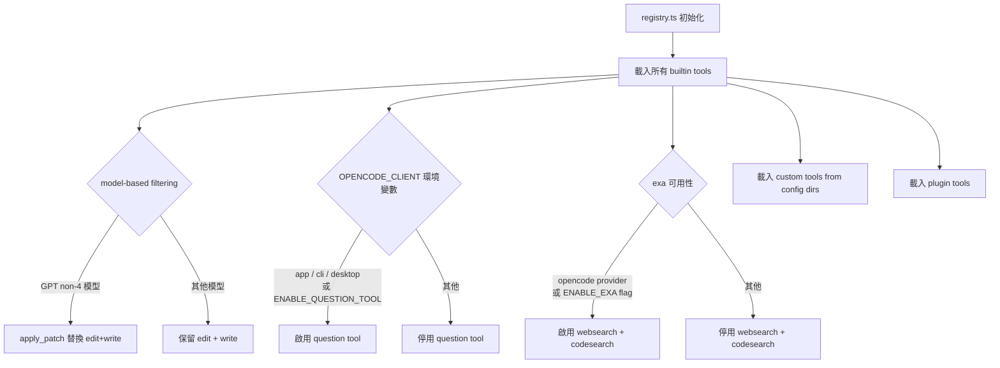
```mermaid
graph TD
    R[registry.ts 初始化] --> B[載入所有 builtin tools]
    B --> M{model-based filtering}
    M -->|GPT non-4 模型| AP[apply_patch 替換 edit+write]
    M -->|其他模型| EW[保留 edit + write]
    B --> Q{OPENCODE_CLIENT 環境變數}
    Q -->|app / cli / desktop<br/>或 ENABLE_QUESTION_TOOL| QT[啟用 question tool]
    Q -->|其他| NoQ[停用 question tool]
    B --> EX{exa 可用性}
    EX -->|opencode provider<br/>或 ENABLE_EXA flag| ExaTools[啟用 websearch + codesearch]
    EX -->|其他| NoExa[停用 websearch + codesearch]
    B --> CS[載入 custom tools from config dirs]
    B --> PS[載入 plugin tools]
```


---

### 1. `bash` — Shell 命令執行

**用途：** 在專案目錄中執行任意 shell 命令（Bash/PowerShell）

**特色：Tree-sitter AST 解析**

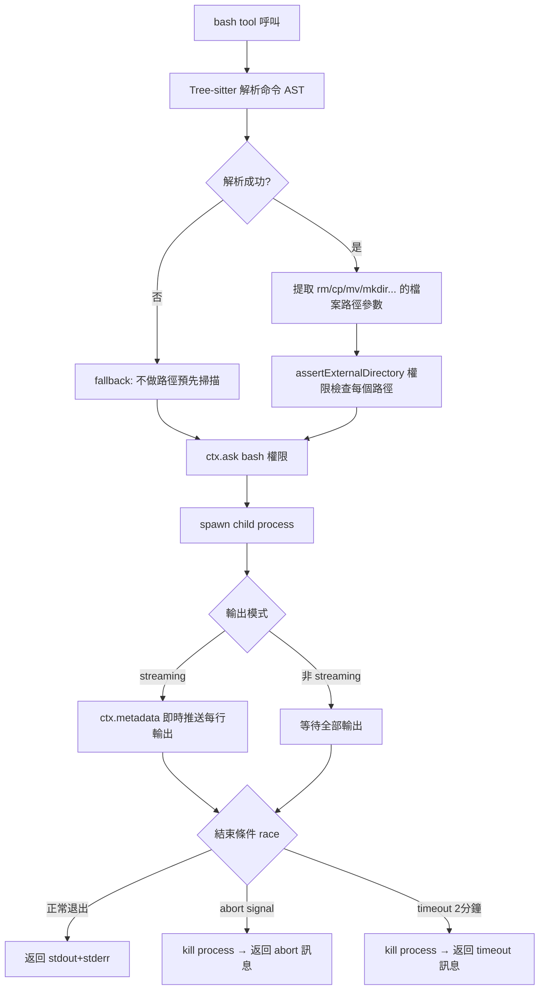
```mermaid
flowchart TD
    A[bash tool 呼叫] --> B[Tree-sitter 解析命令 AST]
    B --> C{解析成功?}
    C -->|是| D[提取 rm/cp/mv/mkdir... 的檔案路徑參數]
    C -->|否| E[fallback: 不做路徑預先掃描]
    D --> F[assertExternalDirectory 權限檢查每個路徑]
    E --> G
    F --> G[ctx.ask bash 權限]
    G --> H[spawn child process]
    H --> I{輸出模式}
    I -->|streaming| J[ctx.metadata 即時推送每行輸出]
    I -->|非 streaming| K[等待全部輸出]
    J --> L{結束條件 race}
    K --> L
    L -->|正常退出| M[返回 stdout+stderr]
    L -->|abort signal| N[kill process → 返回 abort 訊息]
    L -->|timeout 2分鐘| O[kill process → 返回 timeout 訊息]
```


**關鍵實作（`src/tool/bash.ts`）：**

- 使用 `web-tree-sitter` + bash/powershell grammar 解析命令，AST 走訪找出 `rm -rf /etc` 之類的危險路徑 → 在執行前做 `external_directory` 權限掃描
- `ExitStatus` 跟蹤退出碼；非零退出碼也返回而非拋錯，讓 AI 判讀
- 輸出通過 `Truncate.output()` 截斷，全文保存到截斷目錄

---

### 2. `read` — 讀取檔案/目錄

**用途：** 讀取文字檔、圖片、PDF、或列出目錄內容

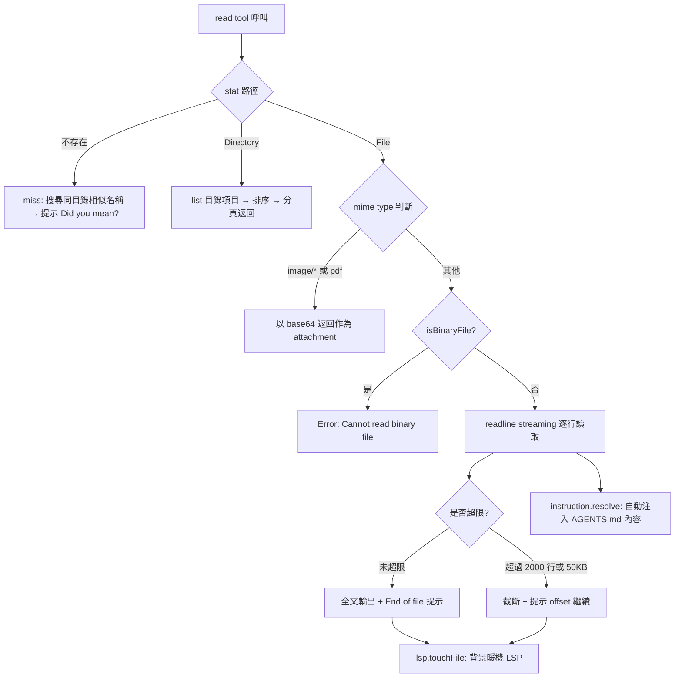
```mermaid
flowchart TD
    A[read tool 呼叫] --> B{stat 路徑}
    B -->|不存在| C[miss: 搜尋同目錄相似名稱 → 提示 Did you mean?]
    B -->|Directory| D[list 目錄項目 → 排序 → 分頁返回]
    B -->|File| E{mime type 判斷}
    E -->|image/* 或 pdf| F[以 base64 返回作為 attachment]
    E -->|其他| G{isBinaryFile?}
    G -->|是| H[Error: Cannot read binary file]
    G -->|否| I[readline streaming 逐行讀取]
    I --> J{是否超限?}
    J -->|超過 2000 行或 50KB| K[截斷 + 提示 offset 繼續]
    J -->|未超限| L[全文輸出 + End of file 提示]
    I --> M[instruction.resolve: 自動注入 AGENTS.md 內容]
    L --> N[lsp.touchFile: 背景暖機 LSP]
    K --> N
```


**關鍵細節：**

- **binary 偵測：** 先看副檔名（zip/exe/dll/jar 等直接判 binary），再讀前 4096 bytes，含 null byte 即 binary，非可印字元 > 30% 即 binary
- **instruction.resolve()：** 根據讀取的檔案路徑往上找 AGENTS.md，透過 claims map 確保每條 assistant message 只注入一次
- **每行最長 2000 chars**，超長行會附加 `... (line truncated to 2000 chars)` 後綴

---

### 3. `edit` — 目標字串替換

**用途：** 在現有檔案中做精確的 oldString → newString 替換

**9-Replacer 降級鏈：**

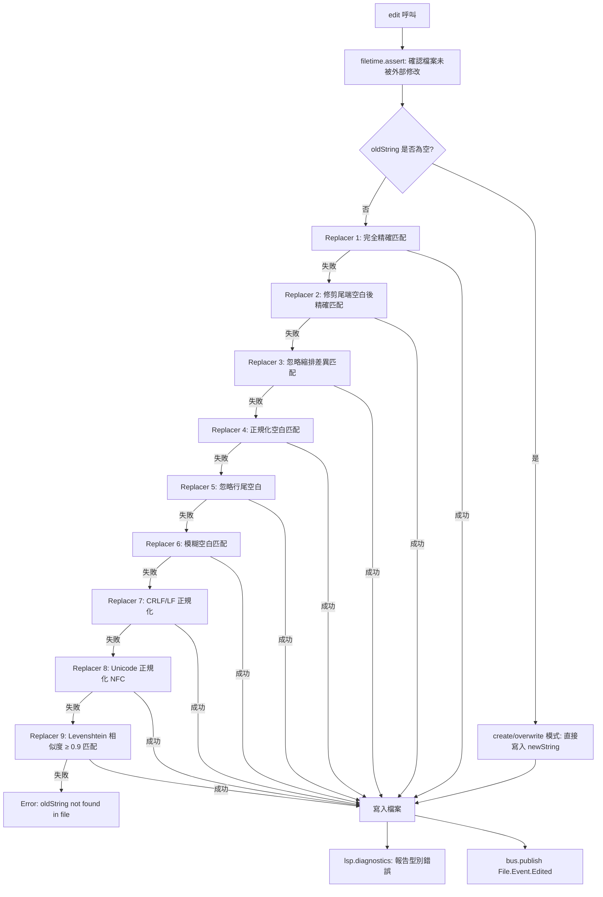
```mermaid
flowchart TD
    A[edit 呼叫] --> B[filetime.assert: 確認檔案未被外部修改]
    B --> C{oldString 是否為空?}
    C -->|是| D[create/overwrite 模式: 直接寫入 newString]
    C -->|否| E[Replacer 1: 完全精確匹配]
    E -->|失敗| F[Replacer 2: 修剪尾端空白後精確匹配]
    F -->|失敗| G[Replacer 3: 忽略縮排差異匹配]
    G -->|失敗| H[Replacer 4: 正規化空白匹配]
    H -->|失敗| I[Replacer 5: 忽略行尾空白]
    I -->|失敗| J[Replacer 6: 模糊空白匹配]
    J -->|失敗| K[Replacer 7: CRLF/LF 正規化]
    K -->|失敗| L[Replacer 8: Unicode 正規化 NFC]
    L -->|失敗| M[Replacer 9: Levenshtein 相似度 ≥ 0.9 匹配]
    M -->|失敗| N[Error: oldString not found in file]
    D --> O[寫入檔案]
    E & F & G & H & I & J & K & L & M -->|成功| O
    O --> P[lsp.diagnostics: 報告型別錯誤]
    O --> Q[bus.publish File.Event.Edited]
```


- `replaceAll: true` 時替換所有匹配（預設只替換第一個）
- 每次 edit 後都呼叫 LSP 取得 diagnostics，若有錯誤一並返回給 AI

---

### 4. `write` — 完整覆寫檔案

**用途：** 建立新檔案或完全覆寫現有檔案

**實作（`src/tool/write.ts`）：**

- 同樣使用 `edit` 權限（非獨立 `write` 權限）
- `assertExternalDirectoryEffect` 檢查路徑合法性
- 寫入後觸發 `format.file()`（自動格式化）
- 對受影響的最多 5 個專案檔執行 `lsp.diagnostics()`

---

### 5. `multiedit` — 多段順序編輯

**用途：** 在同一檔案上依序執行多個 edit 操作

**實作（`src/tool/multiedit.ts`）：**

- 完全包裝 `EditTool`，對 `params.edits` 陣列逐一呼叫 `edit.execute()`
- 每個 edit 操作獨立返回結果，`output` 使用最後一個 edit 的結果
- 適合 AI 在同一檔案做多處不相關的修改而不需要重讀整個檔案

---

### 6. `apply_patch` — Patch 格式多檔操作

**用途：** 用 unified patch 格式同時 add/update/delete/move 多個檔案（給 non-4 GPT 模型用）

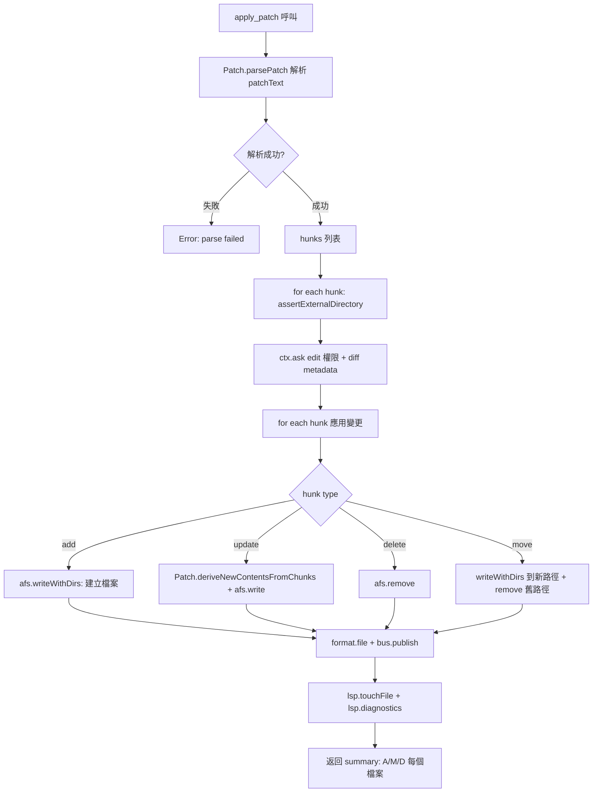
```mermaid
flowchart TD
    A[apply_patch 呼叫] --> B[Patch.parsePatch 解析 patchText]
    B --> C{解析成功?}
    C -->|失敗| ERR[Error: parse failed]
    C -->|成功| D[hunks 列表]
    D --> E[for each hunk: assertExternalDirectory]
    E --> F[ctx.ask edit 權限 + diff metadata]
    F --> G[for each hunk 應用變更]
    G --> H{hunk type}
    H -->|add| I[afs.writeWithDirs: 建立檔案]
    H -->|update| J[Patch.deriveNewContentsFromChunks + afs.write]
    H -->|delete| K[afs.remove]
    H -->|move| L[writeWithDirs 到新路徑 + remove 舊路徑]
    I & J & K & L --> M[format.file + bus.publish]
    M --> N[lsp.touchFile + lsp.diagnostics]
    N --> O[返回 summary: A/M/D 每個檔案]
```


- patch 格式：`*** Begin Patch / *** Update File: path / *** End Patch`
- 支援 `move_path` 欄位做跨路徑移動

---

### 7. `glob` — 檔案模式匹配

**用途：** 用 glob 模式搜尋符合的檔案路徑（如 `**/*.ts`）

**實作（`src/tool/glob.ts`）：**

- 後端：Ripgrep `--files --glob <pattern>`
- 限制：最多返回 100 個結果，依修改時間降序排序（最新在前）
- 不受 `.gitignore` 限制（使用 `--no-ignore` 時）

---

### 8. `grep` — 內容搜尋

**用途：** 用 regex 搜尋檔案內容

**實作（`src/tool/grep.ts`）：**

- 後端：系統 `rg` binary（ChildProcess 呼叫）
- `--field-match-separator=|` 格式：`filepath|line_number|match_content`
- 限制：最多 100 個匹配，依修改時間降序排序
- 支援 `include` glob filter（如 `*.ts`）

---

### 9. `list` — 目錄樹列表

**用途：** 遞迴列出目錄下的檔案結構（tree 格式）

**實作（`src/tool/ls.ts`）：**

- 後端：Ripgrep `--files` 收集所有檔案
- 自動忽略：`node_modules/`, `.git/`, `dist/`, `build/`, `target/`, `vendor/`, `.venv/` 等 20+ 常見不必要目錄
- 限制：最多 100 個檔案
- 輸出：重建 tree 目錄結構（先顯示子目錄，再顯示檔案，字母排序）

```
/home/user/myproject/
  src/
    agent/
      agent.ts
    session/
      prompt.ts
  package.json
```

---

### 10. `webfetch` — HTTP 抓取

**用途：** 抓取 URL 內容，HTML 自動轉換為 Markdown

**實作（`src/tool/webfetch.ts`）：**

- 直接 `fetch()` HTTP GET 請求
- HTML → Markdown：使用 `TurndownService`（保留連結、標題、程式碼區塊）
- 限制：5 MB 上限，30 秒 timeout（可配置）
- SVG/XML 直接返回原始文字

---

### 11. `websearch` — 網路搜尋

**用途：** 用自然語言查詢搜尋網路

**實作（`src/tool/websearch.ts`）：**

- 後端：Exa Search API（`/search` endpoint）
- 啟用條件：`opencode` provider 或 `OPENCODE_ENABLE_EXA=1`
- 預設返回 8 個結果
- 支援 `livecrawl` 選項（強制即時爬取而非快取）
- 每個結果包含：title、URL、published date、text snippet

---

### 12. `codesearch` — 程式碼搜尋

**用途：** 專門搜尋程式碼相關問題（GitHub、Stack Overflow 等）

**實作（`src/tool/codesearch.ts`）：**

- 後端：Exa Search API code 模式（`type: "keyword"`）
- 啟用條件：同 `websearch`
- 輸出量由 token count 控制（1000–50000 tokens），避免 context 爆炸
- 搜尋結果包含完整程式碼內容（非摘要）

---

### 13. `task` — 生成/恢復子 Agent Session

**用途：** 產生一個子 agent 執行獨立任務（Multi-Agent 核心工具）

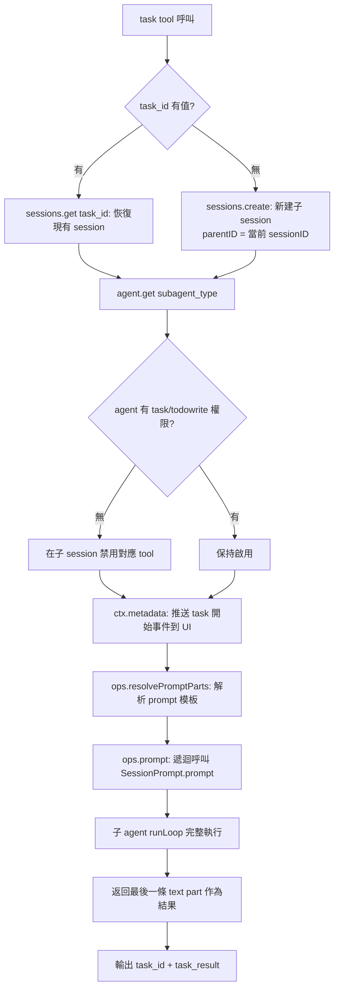
```mermaid
flowchart TD
    A[task tool 呼叫] --> B{task_id 有值?}
    B -->|有| C[sessions.get task_id: 恢復現有 session]
    B -->|無| D[sessions.create: 新建子 session<br/>parentID = 當前 sessionID]
    C & D --> E[agent.get subagent_type]
    E --> F{agent 有 task/todowrite 權限?}
    F -->|無| G[在子 session 禁用對應 tool]
    F -->|有| H[保持啟用]
    G & H --> I[ctx.metadata: 推送 task 開始事件到 UI]
    I --> J[ops.resolvePromptParts: 解析 prompt 模板]
    J --> K[ops.prompt: 遞迴呼叫 SessionPrompt.prompt]
    K --> L[子 agent runLoop 完整執行]
    L --> M[返回最後一條 text part 作為結果]
    M --> N[輸出 task_id + task_result]
```


**子 session 特性：**

- 完全獨立的 message history
- 繼承 abort signal（父取消 → 子也取消）
- 返回結果後父繼續自己的 runLoop

---

### 14. `lsp` — LSP 語言服務查詢

**用途：** 對程式碼執行語義操作（跳轉定義、查找引用、hover 說明等）

**支援操作（`src/tool/lsp.ts`）：**


| 操作                     | 說明                 |
| ---------------------- | ------------------ |
| `goToDefinition`       | 跳轉到符號定義位置          |
| `findReferences`       | 找出所有引用位置           |
| `hover`                | 取得符號的類型/文件說明       |
| `documentSymbol`       | 列出檔案所有符號（函式、類別等）   |
| `workspaceSymbol`      | 跨整個 workspace 搜尋符號 |
| `goToImplementation`   | 跳轉到介面的具體實作         |
| `prepareCallHierarchy` | 準備呼叫階層分析           |
| `incomingCalls`        | 誰呼叫了此函式            |
| `outgoingCalls`        | 此函式呼叫了誰            |


**工作流程：**

1. 路徑解析（相對 → 絕對）+ `assertExternalDirectory` 檢查
2. `lsp.touchFile()` — 確保 LSP server 已載入此檔案
3. `lsp.hasClients()` — 確認有對應語言的 LSP server 在執行
4. 執行對應操作，返回 JSON 格式結果

---

### 15. `todowrite` — 更新待辦清單

**用途：** 讓 AI 維護當前任務的 TODO 清單（整個清單全量更新）

**實作（`src/tool/todo.ts`）：**

- 接受完整 todos 陣列（全量覆蓋，非增量）
- 透過 `Todo.Service` 持久化到 session storage
- 每個 todo 項目包含：`id`, `content`, `status` (pending/in_progress/completed), `priority`
- 返回格式：`N todos（未完成數）`

**設計意圖（來自 anthropic.txt 系統提示）：**

> 複雜任務開始時先建立 TodoWrite 計畫，完成後打勾，讓使用者能看到進度

---

### 16. `question` — 向使用者提問

**用途：** AI 在執行過程中暫停並向使用者索取資訊

**實作（`src/tool/question.ts`）：**

- 接受 `questions` 陣列，每個 question 可有多個選項（select）或自由文字
- 透過 `Question.Service.ask()` 觸發 UI 呈現問題卡片
- **阻塞** runLoop 直到使用者回答
- 返回格式：`"問題文字"="答案"` 組合字串

**啟用條件：**

- 環境變數 `OPENCODE_CLIENT` = `app` / `cli` / `desktop`
- 或 `OPENCODE_ENABLE_QUESTION_TOOL=1`

---

### 17. `plan_exit` — 退出 Plan 模式

**用途：** Plan agent 完成計劃後呼叫，詢問使用者是否切換到 Build agent

**流程（`src/tool/plan.ts`）：**

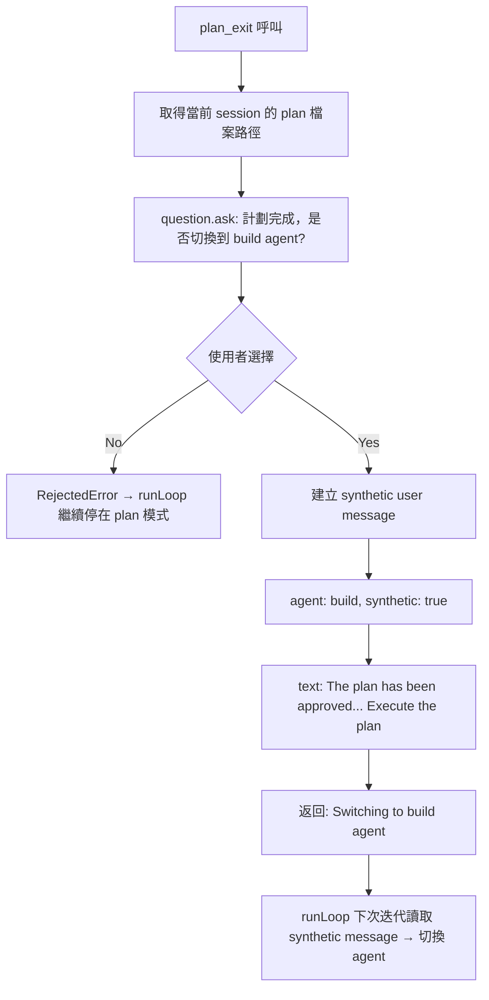
```mermaid
flowchart TD
    A[plan_exit 呼叫] --> B[取得當前 session 的 plan 檔案路徑]
    B --> C[question.ask: 計劃完成，是否切換到 build agent?]
    C --> D{使用者選擇}
    D -->|No| E[RejectedError → runLoop 繼續停在 plan 模式]
    D -->|Yes| F[建立 synthetic user message]
    F --> G[agent: build, synthetic: true]
    G --> H[text: The plan has been approved... Execute the plan]
    H --> I[返回: Switching to build agent]
    I --> J[runLoop 下次迭代讀取 synthetic message → 切換 agent]
```


**切換機制：** 通過寫入 `agent: "build"` 的 synthetic user message 實現 agent 切換，而非直接改變 session 狀態

---

### 18. `skill` — 載入技能指令

**用途：** 動態載入 skill 定義（專門化工作流程指引）

**實作（`src/tool/skill.ts`）：**

- 從 `Skill.Service` 獲取可用技能列表
- **description 是動態的**：在 tool 初始化時根據目前可用 skills 生成（若無 skills 則說明無可用技能）
- 載入後返回 `<skill_content name="...">` 區塊，包含：
  - SKILL.md 全文
  - 技能基礎目錄（`file://` URL）
  - 最多 10 個技能相關檔案列表（`<skill_files>`）

---

### 19. `invalid` — 無效工具佔位

**用途：** 當 AI 呼叫的工具 Zod 驗證失敗時，registry 將其轉為 `invalid` tool 呼叫

**實作（`src/tool/invalid.ts`）：**

```
參數：{ tool: string, error: string }
輸出：The arguments provided to the tool are invalid: <error>
```

讓 AI 知道參數有問題，但不拋出例外破壞 runLoop

---

### 20. `Truncate` — 輸出截斷服務（非獨立 tool）

**用途：** 被所有 tool 的 `Tool.define()` 包裝層自動使用，管理大型輸出

**策略（`src/tool/truncate.ts`）：**

```mermaid
flowchart TD
    A[tool 輸出 text] --> B{text 是否超過 2000行 或 50KB?}
    B -->|否| C[直接返回 content]
    B -->|是| D[截取 head/tail N 行 且 ≤ 50KB]
    D --> E[將完整內容寫入截斷目錄<br/>~/.opencode/truncation/tool_XXXX]
    E --> F{agent 有 task tool?}
    F -->|有| G[提示: 用 Task tool 讓 explore agent 處理此檔案]
    F -->|無| H[提示: 用 Grep/Read with offset 查看]
    G & H --> I[返回: 預覽 + ... N lines truncated ... + hint]
```


**清理機制：** 截斷目錄中超過 7 天的檔案每小時自動清理一次

---

### Tool 全覽表

```mermaid
graph LR
    subgraph 檔案操作
        read["read\n讀取檔案/目錄"]
        write["write\n完整覆寫"]
        edit["edit\n精確替換 9-Replacer"]
        multiedit["multiedit\n多段順序編輯"]
        apply_patch["apply_patch\nPatch格式多檔操作\n(GPT non-4)"]
    end

    subgraph 搜尋導航
        glob["glob\nGlob模式檔案搜尋\nripgrep-backed"]
        grep["grep\nRegex內容搜尋\nripgrep-backed"]
        list["list\n目錄樹結構\n自動忽略常見雜目錄"]
    end

    subgraph Shell執行
        bash["bash\n執行Shell命令\nTree-sitter AST解析"]
    end

    subgraph 網路外部
        webfetch["webfetch\nHTTP GET\nHTML→Markdown"]
        websearch["websearch\nExa自然語言搜尋\n(需Exa)"]
        codesearch["codesearch\nExa程式碼搜尋\n(需Exa)"]
    end

    subgraph AI協調
        task["task\n生成/恢復子Agent\nMulti-Agent核心"]
    end

    subgraph IDE整合
        lsp["lsp\n9種LSP操作\n定義/引用/hover..."]
    end

    subgraph Session管理
        todowrite["todowrite\n全量更新TODO清單"]
        question["question\n向使用者提問\n(需client)"]
    end

    subgraph Agent控制
        plan_exit["plan_exit\n計畫完成→切換Build\n(僅plan agent)"]
        skill["skill\n載入技能指令\n動態description"]
    end

    subgraph 系統內部
        invalid["invalid\n驗證失敗佔位"]
        Truncate["Truncate\n輸出截斷服務\n(自動)"]
    end
```


---

### Tool 使用權限矩陣


| Tool        | build agent | plan agent | general subagent | explore subagent |
| ----------- | ----------- | ---------- | ---------------- | ---------------- |
| bash        | ✅           | ❌          | ✅                | ❌                |
| read        | ✅           | ✅          | ✅                | ✅                |
| edit        | ✅           | ❌（計畫檔案除外）  | ✅                | ❌                |
| write       | ✅           | ❌（計畫檔案除外）  | ✅                | ❌                |
| multiedit   | ✅           | ❌          | ✅                | ❌                |
| apply_patch | ✅           | ❌          | ✅                | ❌                |
| glob        | ✅           | ✅          | ✅                | ✅                |
| grep        | ✅           | ✅          | ✅                | ✅                |
| list        | ✅           | ✅          | ✅                | ✅                |
| webfetch    | ✅           | ✅          | ✅                | ✅                |
| websearch   | ✅           | ✅          | ✅                | ✅                |
| codesearch  | ✅           | ✅          | ✅                | ✅                |
| task        | ✅           | ✅          | ❌（可配置）           | ❌                |
| lsp         | ✅           | ✅          | ✅                | ❌                |
| todowrite   | ✅           | ✅          | ❌（可配置）           | ❌                |
| question    | ✅（需client）  | ✅（需client） | ❌                | ❌                |
| plan_exit   | ❌           | ✅          | ❌                | ❌                |
| skill       | ✅           | ✅          | ✅                | ✅                |


> `explore` agent 預設只允許：read、glob、grep、list、webfetch、websearch、codesearch、lsp（部分）
> `plan` agent 可以 edit/write **僅限** session 計畫檔案（PLAN.md 路徑被明確 allow）

---

## 防越界機制：Tool 安全邊界

> OpenCode **沒有** OS 級沙盒（無 seccomp / chroot / namespace），防護完全在應用層，由三道關卡串聯組成。

### 整體防護架構

```mermaid
flowchart TD
    AI[AI 決定呼叫 tool] --> T[tool.execute]
    T --> L1

    subgraph L1["第一層：目錄邊界（assertExternalDirectoryEffect）"]
        CP{Instance.containsPath\nfilepath?}
        CP -->|Yes 在專案內| PASS1[通過]
        CP -->|No 在專案外| EDA["ctx.ask\npermission=external_directory\npatterns=[dir/*]"]
    end

    subgraph L2["第二層：Permission 規則引擎（evaluate）"]
        EVAL["evaluate(permission, pattern,\n  agent.permission ++ session.permission)"]
        EVAL -->|action=allow| PASS2[通過]
        EVAL -->|action=deny| DENY[DeniedError\nAI 收到阻止訊息]
        EVAL -->|action=ask| ASK[Deferred 暫停\n→ UI 彈出確認]
        ASK -->|使用者 Allow once| PASS2
        ASK -->|使用者 Allow always| PASS2_A[通過 + 加入 approved 規則\ncascade 放行同 session 其他 pending]
        ASK -->|使用者 Reject| REJ[RejectedError\ncascade reject 同 session 所有 pending]
    end

    subgraph L3["第三層：Agent 層內建規則"]
        BUILD["build: '*' = allow"]
        PLAN["plan: edit '*' = deny\n(計畫檔路徑除外)"]
        EXPLORE["explore: '*' = deny\n(明確允許 read/web/search)"]
    end

    PASS1 --> L2
    EDA --> L2
    L3 -->|作為 ruleset 基底| L2
    PASS2 --> EXEC[tool 實際執行]
    PASS2_A --> EXEC
    DENY --> END[tool 不執行]
    REJ --> END
```


---

### 第一層：目錄邊界檢查

**關鍵檔案：** `src/tool/external-directory.ts`、`src/project/instance.ts`

所有會操作檔案的 tool（`read`、`write`、`edit`、`bash` 等）在執行前統一呼叫 `assertExternalDirectoryEffect`：

```
Instance.containsPath(filepath)
  ├─ Filesystem.contains(Instance.directory, filepath)
  │    └─ !path.relative(parent, child).startsWith("..")
  └─ Filesystem.contains(Instance.worktree, filepath)
       └─ 例外：worktree === "/" 時跳過
            （非 git 專案 worktree 為 "/"，不能讓它匹配所有絕對路徑）
```

- 路徑**在專案內** → 直接進入第二層
- 路徑**在專案外** → 先觸發 `external_directory` permission check，使用者確認後才能繼續

#### `bash` 的特殊處理：Tree-sitter AST 掃描

bash 命令可能一次操作多個路徑，且路徑藏在各種子命令裡，無法只看一個參數。

```mermaid
flowchart TD
    CMD["bash tool 收到命令\n例：rm -rf /tmp /etc /var"] --> TS[Tree-sitter 解析 AST]
    TS --> WALK[走訪 AST 節點\n找 rm/cp/mv/mkdir/touch... 的參數]
    WALK --> DIRS["scan.dirs = ['/tmp', '/etc', '/var']"]
    DIRS --> FILTER["過濾：Instance.containsPath?"]
    FILTER -->|在專案內| SKIP[略過]
    FILTER -->|在專案外| COLLECT["收集為 glob 模式\n/tmp/* , /etc/* , /var/*"]
    COLLECT --> ASK["ctx.ask\npermission=external_directory\npatterns=['/tmp/*', '/etc/*', '/var/*']"]
```


---

### 第二層：Permission 規則引擎

**關鍵檔案：** `src/permission/index.ts`、`src/permission/evaluate.ts`

`ctx.ask()` 實際呼叫 `Permission.ask()`，帶入合併後的 ruleset：

```typescript
// src/session/prompt.ts:386
ruleset: Permission.merge(
  agent.permission,    // agent 定義的規則（build/plan/explore 不同）
  session.permission,  // session 規則（來自 config 或 task tool 注入給子 agent）
)
```

**評估函式（`findLast` = 最後一條匹配的規則贏）：**

```typescript
// src/permission/evaluate.ts
function evaluate(permission, pattern, ...rulesets) {
  const rules = rulesets.flat()
  const match = rules.findLast(
    (rule) =>
      Wildcard.match(permission, rule.permission) &&  // 兩個維度都支援 wildcard
      Wildcard.match(pattern, rule.pattern)
  )
  return match ?? { action: "ask" }  // 沒有任何規則匹配 → 預設問使用者
}
```

`permission` 維度（tool 種類）和 `pattern` 維度（路徑/資源）**雙重 wildcard**，所以可以精細設定：

```jsonc
// opencode.jsonc 範例
{
  "permission": {
    "bash": {
      "npm run *": "allow",   // npm 命令直接放行
      "git *":    "allow",    // git 命令直接放行
      "*":        "ask"       // 其他 bash 命令都要詢問
    },
    "edit": {
      "src/**":  "allow",    // src 目錄可直接編輯
      "*.lock":  "deny",     // lock 檔絕對不能動
      "*":       "ask"
    }
  }
}
```

**三種結果：**


| action  | 效果                                           |
| ------- | -------------------------------------------- |
| `allow` | 直接繼續，tool 執行                                 |
| `deny`  | 立即拋出 `DeniedError`，附上觸發的規則訊息告知 AI            |
| `ask`   | 暫停，發出 `permission.asked` 事件，UI 彈出確認視窗，等使用者回覆 |


**使用者回覆選項：**


| 回覆       | 效果                                                                                                           |
| -------- | ------------------------------------------------------------------------------------------------------------ |
| `once`   | 本次放行，規則不保存                                                                                                   |
| `always` | 放行 + 將此 permission/pattern 加入 `approved` 規則集，同 session 中後續相同請求自動通過；並 cascade 放行目前所有等待中的相同 session pending 請求 |
| `reject` | `RejectedError`，AI 收到「使用者拒絕」訊息；同時 cascade reject 同 session 所有其他 pending 請求                                   |


---

### 第三層：Agent 層內建規則

Agent 定義自帶的 `permission` 陣列是 ruleset 的**基底**，使用者 config 規則追加在後（findLast → config 優先）：


| Agent                | 規則摘要                                                       | 實際效果                                       |
| -------------------- | ---------------------------------------------------------- | ------------------------------------------ |
| `build`              | `"*": "allow"`                                             | 幾乎所有操作預設放行（仍受 external_directory 守門）       |
| `plan`               | `edit: { "*": "deny" }` + plan 檔路徑 allow                   | 在非計畫檔上呼叫 edit/write → 直接 DeniedError，不問使用者 |
| `explore`            | `"*": "deny"` + 明確 allow read/glob/grep/webfetch/websearch | bash 完全無法執行；無法寫入任何檔案                       |
| `general` (subagent) | 繼承父 session 規則                                             | 能讀寫，但受父 agent 傳入的 session.permission 限制    |


---

### 案例追蹤：`rm -rf /` 的完整攔截過程

```mermaid
sequenceDiagram
    participant AI
    participant Bash as bash tool
    participant TS as Tree-sitter
    participant AD as assertExternalDir
    participant PM as Permission.ask()
    participant UI as 使用者 UI

    AI->>Bash: execute("rm -rf /")
    Bash->>TS: parseBashAST("rm -rf /")
    TS-->>Bash: scan.dirs = ["/"]
    Bash->>AD: Instance.containsPath("/")
    AD-->>Bash: false（"/" 不在 /home/user/myproject 內）
    Bash->>PM: ask({ permission:"external_directory", patterns:["///*"] })
    PM->>PM: evaluate → 無匹配規則 → action=ask
    PM->>UI: bus.publish(permission.asked)
    UI-->>PM: 使用者點擊 Reject
    PM-->>Bash: RejectedError
    Bash-->>AI: "The user rejected permission to use this specific tool call."
    Note over AI: AI 收到錯誤訊息，不執行，重新規劃
```


---

### 重要限制（不是完美沙盒）


| 限制                    | 說明                                                                                                |
| --------------------- | ------------------------------------------------------------------------------------------------- |
| **Tree-sitter 有盲點**   | `eval "$CMD"` / 變數展開 `$DEST` / heredoc 中的路徑等複雜結構無法提取，此時只做 `bash` 整體 permission check，無路徑分析        |
| **間接腳本**              | `bash ./deploy.sh` 只能看到腳本路徑；腳本內的 `rm -rf /tmp/`* 在 Tree-sitter 層不可見                               |
| **網路操作不受路徑保護**        | `curl -X DELETE https://api.prod.com` 不涉及本地路徑，不觸發 `external_directory`，只受 `bash` 本身 permission 控制 |
| `**"*": "allow"` 設定** | 使用者若在 config 設全放行，`external_directory` check 也被 allow，所有路徑保護失效                                    |
| **無 OS 隔離**           | 整套機制是應用層軟體，OpenCode 進程本身有完整的 OS 使用者權限，不像 Docker/VM 有硬隔離                                           |


**結論：** OpenCode 的防越界是「需要使用者配合的信任機制」，核心設計是「超出專案目錄的所有操作預設必須詢問使用者」，而非強制沙盒。最終決定權在使用者與其 config 設定。