# OpenCode Plan & Build 完整流程解析

> 涵蓋：TUI/CLI 入口 → Prompt 組裝 → Plan 拆分步驟 → Build 執行 → Multi-Agent 協作

---

## 目錄

1. [整體架構概覽](#整體架構概覽)
2. [入口層：TUI vs CLI](#入口層tui-vs-cli)
3. [HTTP 層：Session API](#http-層session-api)
4. [核心循環：SessionPrompt.runLoop](#核心循環sessionpromptrunloop)
5. [Prompt 組裝細節](#prompt-組裝細節)
6. [Plan 模式：完整流程](#plan-模式完整流程)
7. [Build 模式：完整流程](#build-模式完整流程)
8. [Multi-Agent 協作機制](#multi-agent-協作機制)
9. [事件系統與 UI 更新](#事件系統與-ui-更新)
10. [關鍵檔案索引](#關鍵檔案索引)

---

## 整體架構概覽

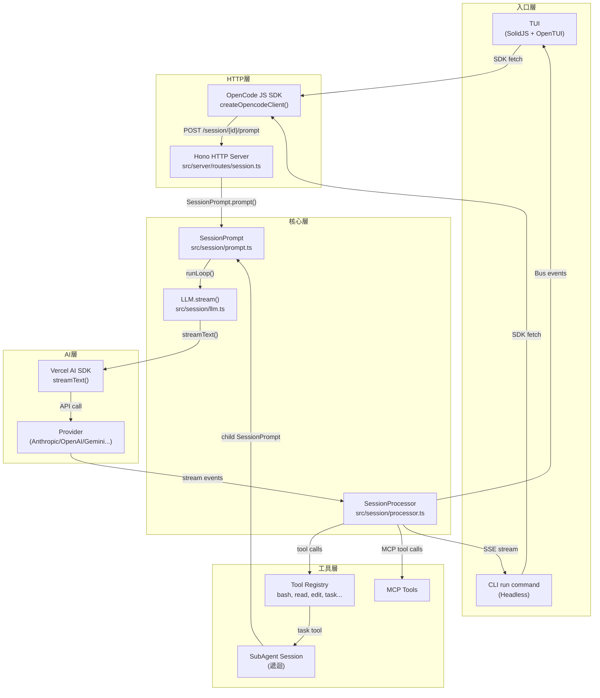

---

## 入口層：TUI vs CLI

### TUI 路徑

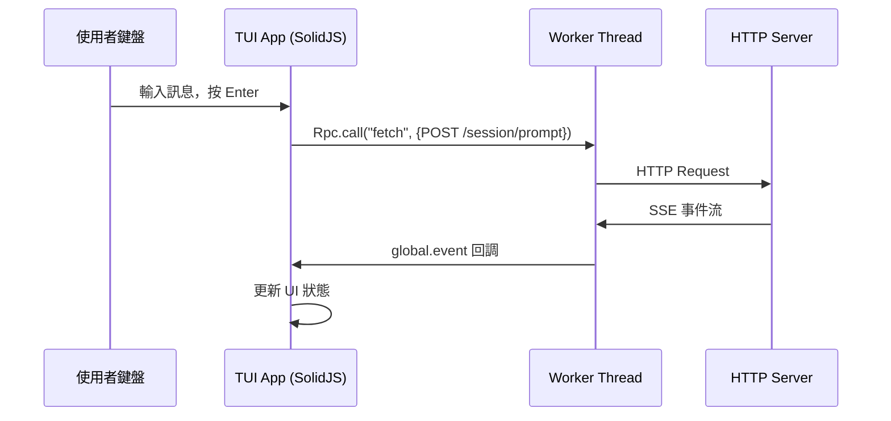

**關鍵檔案：** `src/cli/cmd/tui/thread.ts`

TUI 啟動流程：
1. `TuiThreadCommand` 建立 Worker 子程序
2. 透過 `Rpc.client` 將所有 fetch 請求代理到 Worker（Worker 中執行真正的 Server）
3. SolidJS 組件透過 SDK 訂閱 `global.event` 事件串流
4. 使用者送出訊息 → `sdk.session.prompt()` → Worker → Server

### CLI run 路徑

**關鍵檔案：** `src/cli/cmd/run.ts`

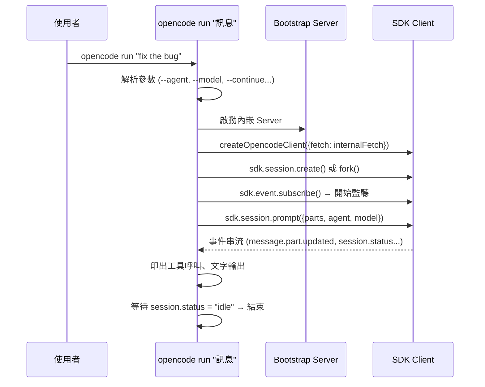

**CLI 的 Permission 規則（無互動模式）：**
```typescript
// src/cli/cmd/run.ts:362-378
const rules: Permission.Ruleset = [
  { permission: "question",   action: "deny", pattern: "*" }, // 不允許 AI 問使用者問題
  { permission: "plan_enter", action: "deny", pattern: "*" }, // 不允許進入 plan 模式
  { permission: "plan_exit",  action: "deny", pattern: "*" }, // 不允許退出 plan 模式
]
```

---

## HTTP 層：Session API

**關鍵檔案：** `src/server/routes/session.ts`

主要端點：

| 端點 | 功能 |
|------|------|
| `POST /session` | 建立新 session |
| `POST /session/{id}/prompt` | 送出使用者訊息並觸發 AI |
| `POST /session/{id}/command` | 執行 slash command |
| `GET /session/status` | SSE 事件流 |
| `POST /session/{id}/fork` | 複製 session |

`/prompt` 端點呼叫路徑：
```
POST /session/{id}/prompt
  → AppRuntime.run(SessionPrompt.Service)
  → sessionPrompt.prompt(input)
```

---

## 核心循環：SessionPrompt.runLoop

**關鍵檔案：** `src/session/prompt.ts:1297` — `runLoop()`

這是整個 AI 執行的心臟。每次迭代代表一個「步驟」(step)，包含一次完整的 LLM 呼叫。

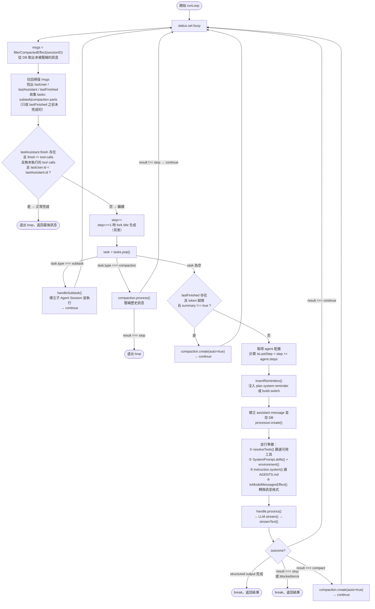

---

## Prompt 組裝細節

### System Prompt 組裝順序

**關鍵檔案：** `src/session/llm.ts:106-131`

組裝發生在兩個地方，呼叫順序如下：

**第一步：`runLoop` 組裝 `input.system`（`src/session/prompt.ts:1464-1470`）**

```typescript
// 這裡的 system 是傳給 LLM.stream() 的 input.system
const [skills, env, instructions, modelMsgs] = await Effect.all([
  SystemPrompt.skills(agent),       // 可用 skills 列表
  SystemPrompt.environment(model),  // 工作目錄、平台、日期
  instruction.system(),             // AGENTS.md / CLAUDE.md 內容
  MessageV2.toModelMessagesEffect(msgs, model),
])
const system = [...env, ...(skills ? [skills] : []), ...instructions]
```

**第二步：`LLM.stream()` 將所有來源合併為 `system[0]`（`src/session/llm.ts:106-131`）**

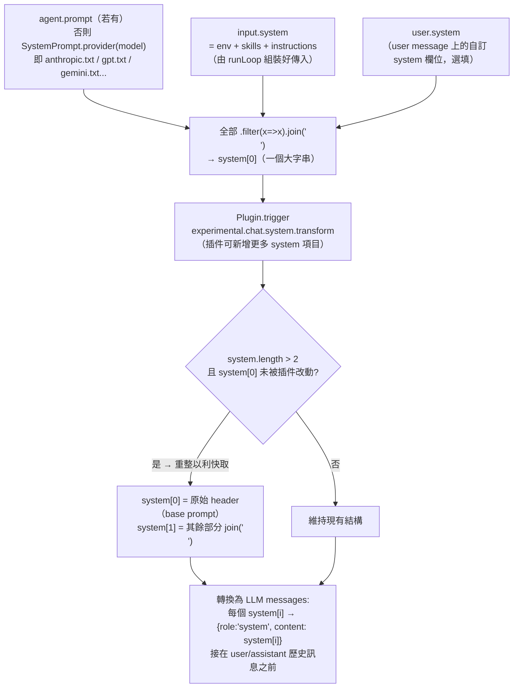

### 組裝完成後的完整 Prompt 範例

以下展示三種情境下實際送給 LLM 的完整訊息結構。

---

#### 情境一：Build Agent + Claude（正常執行，無 Plugin）

> 條件：`agent = build`、`model = claude-sonnet-4-6`、無 user.system、無 plugin 介入

```
╔══════════════════════════════════════════════════════════════════════╗
║  messages[0]  role: "system"                                         ║
║  來源：LLM.stream() system[0]（一切 join('\n') 後的大字串）          ║
╚══════════════════════════════════════════════════════════════════════╝

━━━ [區塊 1] Provider Base Prompt ━━━━━━━━━━━━━━━━━━━━━━━━━━━━━━━━━━━━
  來源：SystemPrompt.provider(model) → src/session/prompt/anthropic.txt
  （因為 build agent 無 agent.prompt，所以用 provider 判斷）

You are OpenCode, the best coding agent on the planet.

You are an interactive CLI tool that helps users with software engineering tasks.
Use the instructions below and the tools available to you to assist the user.

IMPORTANT: You must NEVER generate or guess URLs for the user unless you are
confident that the URLs are for helping the user with programming.
You may use URLs provided by the user in their messages or local files.

If the user asks for help or wants to give feedback inform them of the following:
- ctrl+p to list available actions
- To give feedback, users should report the issue at
  https://github.com/anomalyco/opencode

When the user directly asks about OpenCode (eg. "can OpenCode do..."), use the
WebFetch tool to gather information from OpenCode docs.
The list of available docs is available at https://opencode.ai/docs

# Tone and style
- Only use emojis if the user explicitly requests it.
- Your output will be displayed on a command line interface.
  Your responses should be short and concise.
- Output text to communicate with the user; all text you output outside of tool
  use is displayed to the user.
- NEVER create files unless they're absolutely necessary for achieving your goal.

# Professional objectivity
Prioritize technical accuracy and truthfulness over validating the user's beliefs.
...

# Task Management
You have access to the TodoWrite tools to help you manage and plan tasks.
Use these tools VERY frequently to ensure that you are tracking your tasks...

# Doing tasks
The user will primarily request you perform software engineering tasks.
...

# Tool usage policy
- When doing file search, prefer to use the Task tool in order to reduce context usage.
- You should proactively use the Task tool with specialized agents...
...

# Code References
When referencing specific functions or pieces of code include the pattern
`file_path:line_number` to allow the user to easily navigate to the source code.

━━━ [區塊 2] Environment Block ━━━━━━━━━━━━━━━━━━━━━━━━━━━━━━━━━━━━━━━
  來源：SystemPrompt.environment(model) → src/session/system.ts:36-61
  （這是 input.system[0]，由 runLoop 組裝後傳入）

You are powered by the model named claude-sonnet-4-6.
The exact model ID is anthropic/claude-sonnet-4-6
Here is some useful information about the environment you are running in:
<env>
  Working directory: /home/user/Project/myapp
  Workspace root folder: /home/user/Project/myapp
  Is directory a git repo: yes
  Platform: linux
  Today's date: Mon Apr 13 2026
</env>
<directories>
</directories>

━━━ [區塊 3] Skills Block ━━━━━━━━━━━━━━━━━━━━━━━━━━━━━━━━━━━━━━━━━━━
  來源：SystemPrompt.skills(agent) → src/session/system.ts:63-75
  （這是 input.system[1]，只有在 skill 工具未被 deny 時才有）

Skills provide specialized instructions and workflows for specific tasks.
Use the skill tool to load a skill when a task matches its description.

- commit: Use when committing code. Stages changes, writes conventional commit
  messages, and handles pre-commit hooks.
- review-pr: Use when reviewing pull requests. Checks diff, comments on issues,
  and summarizes changes.
- ...（其他已安裝的 skills）

━━━ [區塊 4] Instructions（AGENTS.md 內容）━━━━━━━━━━━━━━━━━━━━━━━━━━━
  來源：instruction.system() → src/session/instruction.ts:164-178
  （這是 input.system[2]，從專案目錄向上找 AGENTS.md / CLAUDE.md）

Instructions from: /home/user/Project/myapp/AGENTS.md
# Project Conventions
- Use Effect for all async operations
- Single-word variable names preferred
- No try/catch — use Effect.catch instead
...

╔══════════════════════════════════════════════════════════════════════╗
║  messages[1]  role: "user"                                           ║
║  來源：MessageV2.toModelMessagesEffect() 轉換歷史訊息                ║
╚══════════════════════════════════════════════════════════════════════╝

fix the bug in src/session/llm.ts where tokens are being double-counted

╔══════════════════════════════════════════════════════════════════════╗
║  messages[2]  role: "assistant"  （上一輪工具呼叫，第二步以後才有）  ║
╚══════════════════════════════════════════════════════════════════════╝

[tool_use: read, id: "tc_01", input: {filePath: "src/session/llm.ts"}]

╔══════════════════════════════════════════════════════════════════════╗
║  messages[3]  role: "user"  （工具結果）                             ║
╚══════════════════════════════════════════════════════════════════════╝

[tool_result: id: "tc_01", content: "...llm.ts 的檔案內容..."]
```

> **注意**：沒有 plugin 介入時，所有內容 join 成**單一 system 字串**送出（`system.length === 1`），不分兩段。

---

#### 情境二：Plan Agent（第一次進入 Plan 模式）

> 條件：`agent = plan`、第一次呼叫（尚無 plan 檔案）、`Flag.OPENCODE_EXPERIMENTAL_PLAN_MODE = true`

Plan agent 本身**沒有 `agent.prompt`**，所以 `system[0]` 的開頭和 build agent 完全相同（都是 anthropic.txt）。差別在於 `insertReminders()` 把 plan 指令注入到 **user message** 裡作為 synthetic text part，**不在 system prompt 中**。

```
╔══════════════════════════════════════════════════════════════════════╗
║  messages[0]  role: "system"                                         ║
╚══════════════════════════════════════════════════════════════════════╝

━━━ [區塊 1] Provider Base Prompt ━━━━━━━━━━━━━━━━━━━━━━━━━━━━━━━━━━━━
  （與 build agent 完全相同：anthropic.txt 全文）

You are OpenCode, the best coding agent on the planet.
...（同上）

━━━ [區塊 2] Environment Block ━━━━━━━━━━━━━━━━━━━━━━━━━━━━━━━━━━━━━━━
  （與 build agent 相同）

━━━ [區塊 3] Skills Block ━━━━━━━━━━━━━━━━━━━━━━━━━━━━━━━━━━━━━━━━━━━
  （與 build agent 相同，但 skill 工具若被 deny 則此區塊不存在）

━━━ [區塊 4] Instructions ━━━━━━━━━━━━━━━━━━━━━━━━━━━━━━━━━━━━━━━━━━━
  （與 build agent 相同：AGENTS.md 內容）

╔══════════════════════════════════════════════════════════════════════╗
║  messages[1]  role: "user"                                           ║
║  包含多個 parts，其中最後一個是 insertReminders() 注入的 synthetic   ║
╚══════════════════════════════════════════════════════════════════════╝

━━━ [part 1] 使用者原始訊息（type: text，非 synthetic）━━━━━━━━━━━━━
add a retry mechanism to the HTTP client

━━━ [part 2] Plan 工作流程指令（type: text，synthetic: true）━━━━━━━
  來源：insertReminders() → src/session/prompt.ts:260-343
  這個 part 由 system 注入，使用者看不到

<system-reminder>
Plan mode is active. The user indicated that they do not want you to execute yet
-- you MUST NOT make any edits (with the exception of the plan file mentioned
below), run any non-readonly tools (including changing configs or making commits),
or otherwise make any changes to the system. This supersedes any other
instructions you have received.

## Plan File Info:
No plan file exists yet. You should create your plan at
/home/user/.local/share/opencode/plans/01JRXYZ123.md using the write tool.
You should build your plan incrementally by writing to or editing this file.
NOTE that this is the only file you are allowed to edit.

## Plan Workflow

### Phase 1: Initial Understanding
Goal: Gain a comprehensive understanding of the user's request by reading through
code and asking them questions. Critical: In this phase you should only use the
explore subagent type.

1. Focus on understanding the user's request and the code associated with it
2. **Launch up to 3 explore agents IN PARALLEL** (single message, multiple calls)
   - Use 1 agent when the task is isolated to known files
   - Use multiple agents when scope is uncertain
3. After exploring, use the question tool to clarify ambiguities

### Phase 2: Design
Goal: Design an implementation approach.
Launch general agent(s) to design the implementation.
You can launch up to 1 agent(s) in parallel.

### Phase 3: Review
Goal: Review the plan(s) and ensure alignment with user's intentions.
1. Read the critical files identified by agents
2. Ensure plans align with original request
3. Use question tool to clarify remaining questions

### Phase 4: Final Plan
Goal: Write final plan to the plan file.
- Include only recommended approach
- Include paths of critical files to modify
- Include verification section

### Phase 5: Call plan_exit tool
At the very end, call plan_exit to indicate you are done planning.
Your turn should only end with asking a question or calling plan_exit.
</system-reminder>
```

---

#### 情境三：Explore Subagent（由 Task Tool 建立的子 Session）

> 條件：`agent = explore`，這是 plan agent 啟動的子 session

Explore agent **有 `agent.prompt`**（`src/agent/prompt/explore.txt`），所以 `system[0]` 的開頭**不是 anthropic.txt，而是 explore.txt**。

```
╔══════════════════════════════════════════════════════════════════════╗
║  messages[0]  role: "system"                                         ║
╚══════════════════════════════════════════════════════════════════════╝

━━━ [區塊 1] Agent-Specific Prompt ━━━━━━━━━━━━━━━━━━━━━━━━━━━━━━━━━━
  來源：agent.prompt → src/agent/prompt/explore.txt
  （因為 explore agent 有自己的 prompt，所以「取代」provider base prompt）

You are a file search specialist. You excel at thoroughly navigating
and exploring codebases.

Your strengths:
- Rapidly finding files using glob patterns
- Searching code and text with powerful regex patterns
- Reading and analyzing file contents

Guidelines:
- Use Glob for broad file pattern matching
- Use Grep for searching file contents with regex
- Use Read when you know the specific file path you need to read
- Use Bash for file operations like copying, moving, or listing directory contents
- Adapt your search approach based on the thoroughness level specified by the caller
- Return file paths as absolute paths in your final response
- For clear communication, avoid using emojis
- Do not create any files, or run bash commands that modify the user's system
  state in any way

Complete the user's search request efficiently and report your findings clearly.

━━━ [區塊 2] Environment Block ━━━━━━━━━━━━━━━━━━━━━━━━━━━━━━━━━━━━━━━
  （與主 agent 相同，子 session 也有完整 env context）

━━━ [區塊 3] Skills Block ━━━━━━━━━━━━━━━━━━━━━━━━━━━━━━━━━━━━━━━━━━━
  （explore agent 的 permission 允許 skill 工具，所以有此區塊）

━━━ [區塊 4] Instructions ━━━━━━━━━━━━━━━━━━━━━━━━━━━━━━━━━━━━━━━━━━━
  （AGENTS.md 內容，子 session 同樣載入）

╔══════════════════════════════════════════════════════════════════════╗
║  messages[1]  role: "user"                                           ║
║  來源：task tool 的 prompt 參數，由父 agent 填寫                     ║
╚══════════════════════════════════════════════════════════════════════╝

━━━ [part 1] 父 Session 的最後訊息摘要（TaskTool 自動加入）━━━━━━━━━

<context>
Parent session context: The user wants to add a retry mechanism to the HTTP client.
We are in planning phase.
</context>

━━━ [part 2] 任務描述（task tool 的 prompt 參數）━━━━━━━━━━━━━━━━━━━

Find all files related to the HTTP client in this codebase. Look for:
1. The main HTTP client implementation
2. Any existing retry or error handling patterns
3. Where the HTTP client is used
Thoroughness: medium
```

---

#### 情境四：Plan → Build 切換（第一次執行 Build）

> 條件：session 歷史中有 plan agent 的回覆，現在切換到 build agent

```
╔══════════════════════════════════════════════════════════════════════╗
║  messages[0]  role: "system"  （與情境一完全相同）                   ║
╚══════════════════════════════════════════════════════════════════════╝

━━━ [區塊 1-4] 與 build agent 相同 ━━━━━━━━━━━━━━━━━━━━━━━━━━━━━━━━━━

╔══════════════════════════════════════════════════════════════════════╗
║  messages[1..N]  歷史訊息（Plan 階段的所有對話）                    ║
╚══════════════════════════════════════════════════════════════════════╝

role: user    → add a retry mechanism to the HTTP client
              + <system-reminder>Plan mode is active...</system-reminder>  ← synthetic
role: assistant → [task tool calls to explore agents...]
role: user    → [tool results from explore agents...]
role: assistant → [plan_exit tool call]
role: user    → [plan_exit result: 使用者確認執行]

╔══════════════════════════════════════════════════════════════════════╗
║  messages[N+1]  role: "user"  （切換到 build 後的第一個 user msg）  ║
╚══════════════════════════════════════════════════════════════════════╝

━━━ [part 1] 使用者訊息（原始或空，視情況）━━━━━━━━━━━━━━━━━━━━━━━━
（可能是使用者按下「Execute Plan」，無新文字）

━━━ [part 2] Build-Switch 提醒（synthetic: true）━━━━━━━━━━━━━━━━━━━
  來源：insertReminders() → src/session/prompt/build-switch.txt
  + Plan 檔案路徑提示（OPENCODE_EXPERIMENTAL_PLAN_MODE 開啟時）

<system-reminder>
Your operational mode has changed from plan to build.
You are no longer in read-only mode.
You are permitted to make file changes, run shell commands,
and utilize your arsenal of tools as needed.
</system-reminder>

A plan file exists at /home/user/.local/share/opencode/plans/01JRXYZ123.md.
You should execute on the plan defined within it
```

---

### 各情境 System Prompt 差異對照

| | build agent | plan agent | explore subagent |
|---|---|---|---|
| 區塊 1 來源 | `anthropic.txt` | `anthropic.txt`（同上） | `explore.txt`（取代） |
| 區塊 2 env | ✓ | ✓ | ✓ |
| 區塊 3 skills | ✓（有 skill 工具） | ✓ | ✓ |
| 區塊 4 instructions | ✓ AGENTS.md | ✓ AGENTS.md | ✓ AGENTS.md |
| Plan 工作流程 | ✗ | **user message** 中注入 | ✗ |
| Build-switch | ✗ | ✗ | ✗ |
| Build-switch 出現 | plan→build 切換時 user message 中注入 | ✗ | ✗ |

> **核心規律**：system prompt 本體各 agent 幾乎相同；**agent 行為差異主要靠 permission 規則限制工具**，以及在 **user message 注入 synthetic text parts** 來改變 AI 的行為模式，而非靠不同的 system prompt。

---

### Provider 特定 Base Prompt 選擇

**關鍵檔案：** `src/session/system.ts:20-33`

```typescript
export function provider(model: Provider.Model) {
  if (model.api.id.includes("gpt-4") || model.api.id.includes("o1") || ...)
    return [PROMPT_BEAST]     // src/session/prompt/beast.txt
  if (model.api.id.includes("gpt"))
    return [PROMPT_GPT]       // src/session/prompt/gpt.txt
  if (model.api.id.includes("gemini-"))
    return [PROMPT_GEMINI]    // src/session/prompt/gemini.txt
  if (model.api.id.includes("claude"))
    return [PROMPT_ANTHROPIC] // src/session/prompt/anthropic.txt
  ...
  return [PROMPT_DEFAULT]     // src/session/prompt/default.txt
}
```

### Environment Block 內容

**關鍵檔案：** `src/session/system.ts:36-61`

```
You are powered by the model named claude-sonnet-4-6. The exact model ID is anthropic/claude-sonnet-4-6
Here is some useful information about the environment you are running in:
<env>
  Working directory: /home/user/Project/myapp
  Workspace root folder: /home/user/Project/myapp
  Is directory a git repo: yes
  Platform: linux
  Today's date: Sun Apr 13 2026
</env>
```

### Instructions（AGENTS.md / CLAUDE.md）載入

**關鍵檔案：** `src/session/instruction.ts`

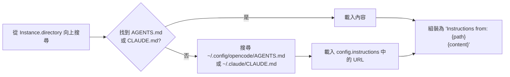

**Read 工具觸發的 inline 載入（`src/session/instruction.ts:187-229`）：**

當 AI 讀取某個檔案時，系統會自動搜尋該檔案目錄及其父目錄中的 instruction 檔案，並附加到後續訊息中（每個 assistant message 只附加一次）。

### Skills 系統

**關鍵檔案：** `src/session/system.ts:63-75`

```typescript
export async function skills(agent: Agent.Info) {
  const list = await Skill.available(agent)
  return [
    "Skills provide specialized instructions and workflows for specific tasks.",
    "Use the skill tool to load a skill when a task matches its description.",
    Skill.fmt(list, { verbose: true }), // 詳細格式的 skills 清單
  ].join("\n")
}
```

---

## Plan 模式：完整流程

### Agent 定義

**關鍵檔案：** `src/agent/agent.ts:123-146`

```typescript
plan: {
  name: "plan",
  description: "Plan mode. Disallows all edit tools.",
  permission: Permission.merge(
    defaults,
    Permission.fromConfig({
      question: "allow",        // 可以問使用者問題
      plan_exit: "allow",       // 可以退出 plan 模式
      external_directory: {
        [path.join(Global.Path.data, "plans", "*")]: "allow",
      },
      edit: {
        "*": "deny",                               // 禁止所有 edit
        [path.join(".opencode", "plans", "*.md")]: "allow", // 只允許編輯 plan 檔案
        [path.join(Global.Path.data, "plans", "*.md")]: "allow",
      },
    }),
    user,
  ),
  mode: "primary",
  native: true,
}
```

### Plan 模式 System Prompt 注入

**關鍵檔案：** `src/session/prompt.ts:218-343` — `insertReminders()`

當 `agent.name === "plan"` 時，在最後一個 user message 中注入以下內容（作為 synthetic text part）：

```markdown
<system-reminder>
Plan mode is active. The user indicated that they do not want you to execute yet --
you MUST NOT make any edits (with the exception of the plan file mentioned below),
run any non-readonly tools, or otherwise make any changes to the system.

## Plan File Info:
A plan file already exists at .opencode/plans/{sessionID}.md (或提示建立新的)
You should build your plan incrementally by writing to or editing this file.
NOTE that this is the only file you are allowed to edit - other than this you are only allowed to take READ-ONLY actions.

## Plan Workflow

### Phase 1: Initial Understanding
Goal: Gain a comprehensive understanding of the user's request

1. Focus on understanding the user's request and the code associated with their request
2. **Launch up to 3 explore agents IN PARALLEL** (single message, multiple tool calls)
   - Use 1 agent when the task is isolated to known files
   - Use multiple agents when scope is uncertain or multiple areas involved
   - Quality over quantity - 3 agents maximum

3. After exploring the code, use the question tool to clarify ambiguities

### Phase 2: Design
Goal: Design an implementation approach.
Launch general agent(s) to design the implementation.
Can launch up to 1 agent(s) in parallel.

### Phase 3: Review
Goal: Review the plan(s) and ensure alignment with user's intentions.
1. Read critical files to deepen understanding
2. Ensure plans align with original request
3. Use question tool for remaining questions

### Phase 4: Final Plan
Goal: Write final plan to plan file (the ONLY file you can edit).
- Include only recommended approach, not all alternatives
- Include paths of critical files to modify
- Include verification section for testing

### Phase 5: Call plan_exit tool
At the very end - call plan_exit to indicate planning is done.
Your turn should only end with either asking a question or calling plan_exit.
</system-reminder>
```

### Plan 模式可用工具一覽

Plan agent 的 permission 繼承自 `defaults`（`"*": "allow"`），再限制 edit 為唯讀。因此以下工具全部可用：

| 工具 | 來源 | 說明 |
|------|------|------|
| `glob` / `grep` / `read` / `list` | 本地 Filesystem | 搜尋與讀取專案檔案 |
| `bash` | 本地 Shell | 執行唯讀命令（`git log`, `cat`, `find`...） |
| `webfetch` | 外部 HTTP | 抓取指定 URL，HTML 自動轉 Markdown（TurndownService） |
| `websearch` | Exa Search API | 全網搜尋，返回帶摘要的結果列表 |
| `codesearch` | Exa Code Search API | 搜尋程式碼範例、API 文件、SDK 用法 |
| `task` | 子 Session | 啟動 explore / general subagent |
| `question` | Permission Bus | 向使用者提問，等待回答 |
| `write` | Filesystem | **只允許寫入 plan 檔案**（其他 path 被 deny） |
| `plan_exit` | Permission Bus | 宣告 plan 完成，觸發 build 切換提示 |

> **Explore subagent** 的工具清單與 plan agent 幾乎相同（glob/grep/list/bash/read/webfetch/websearch/codesearch），但**明確禁止所有寫入操作**（permission `"*": "deny"` 再個別 allow 上列工具）。

---

### Plan 流程完整時序圖（含外部來源）

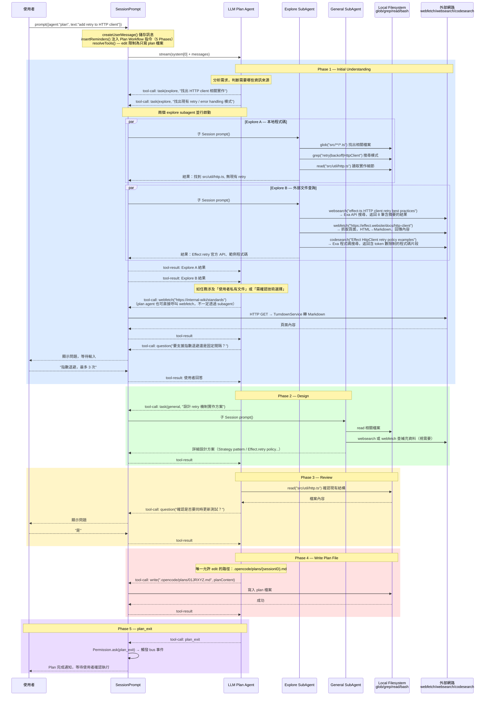

### webfetch / websearch / codesearch 三者差異

| | webfetch | websearch | codesearch |
|---|---|---|---|
| 工具檔案 | `src/tool/webfetch.ts` | `src/tool/websearch.ts` | `src/tool/codesearch.ts` |
| 後端 | 直接 HTTP GET | Exa Search API | Exa Search API（code 模式）|
| 輸入 | URL | 自然語言查詢 | 自然語言查詢（偏程式碼）|
| 輸出格式 | 單頁完整內容（HTML→Markdown） | 多筆結果 + 摘要（含 livecrawl 選項）| 多筆程式碼片段（token 數可控）|
| 典型用途 | 讀取已知文件頁面、API spec | 搜尋不知道 URL 的主題 | 找第三方 SDK 使用範例 |
| permission id | `webfetch` | `websearch` | `codesearch` |

---

## Build 模式：完整流程

### Agent 定義

**關鍵檔案：** `src/agent/agent.ts:108-122`

```typescript
build: {
  name: "build",
  description: "The default agent. Executes tools based on configured permissions.",
  permission: Permission.merge(
    defaults,
    Permission.fromConfig({
      question: "allow",    // 可以問使用者問題
      plan_enter: "allow",  // 可以進入 plan 模式
    }),
    user,
  ),
  mode: "primary",
  native: true,
}
```

**預設 permissions（`src/agent/agent.ts:86-103`）：**
```typescript
const defaults = Permission.fromConfig({
  "*": "allow",              // 預設允許所有工具
  doom_loop: "ask",          // 偵測到循環時需確認
  external_directory: { "*": "ask" }, // 外部目錄需確認
  question: "deny",          // 預設不允許 AI 問問題
  plan_enter: "deny",
  plan_exit: "deny",
  read: {
    "*": "allow",
    "*.env": "ask",   // 敏感 env 檔案需確認
    "*.env.*": "ask",
    "*.env.example": "allow",
  },
})
```

### Plan → Build 切換

**關鍵檔案：** `src/session/prompt.ts:229-239`

當 session 中曾經出現 plan agent 的回覆，且現在切換到 build agent 時，在 user message 中注入：

**`src/session/prompt/build-switch.txt` 內容：**
```
<system-reminder>
Your operational mode has changed from plan to build.
You are no longer in read-only mode.
You are permitted to make file changes, run shell commands,
and utilize your arsenal of tools as needed.
</system-reminder>
```

同時（實驗性 plan mode 下）注入：
```
A plan file exists at {plan}. You should execute on the plan defined within it
```

### Build 執行流程（帶 Multi-Agent）

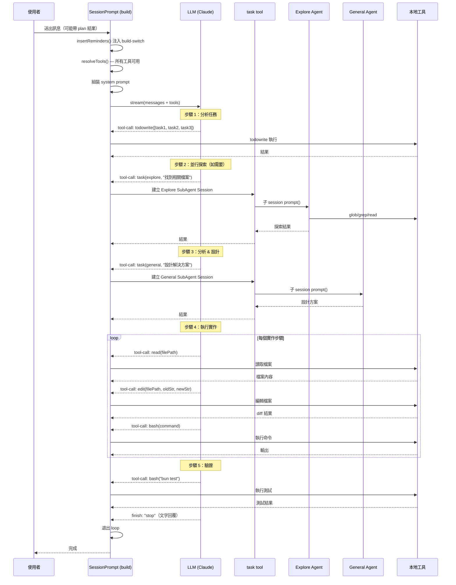

---

## Multi-Agent 協作機制

### Task Tool 詳解

**關鍵檔案：** `src/tool/task.ts`

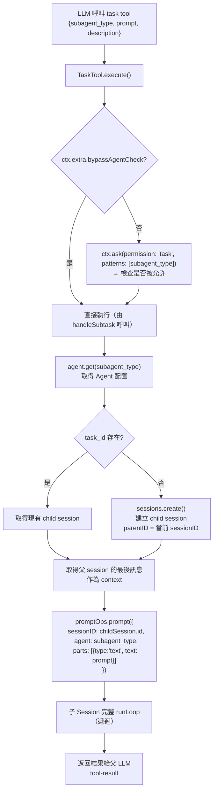

**Task Tool 的 `task_id` 機制（`src/tool/task.ts`）：**

```typescript
// 如果有 task_id，繼續使用舊的子 session（保留上下文）
const session = taskID
  ? await sessions.get(SessionID.make(taskID))
  : undefined

// 否則建立新的 child session
const nextSession = session ?? await sessions.create({
  parentID: ctx.sessionID,
  title: params.description + ` (@${next.name} subagent)`,
})
```

這讓 LLM 可以「恢復」先前的子任務，保留 context。

### Agent 類型與權限矩陣

| Agent | mode | 允許工具 | 禁止工具 | 用途 |
|-------|------|----------|----------|------|
| `build` | primary | 全部 | - | 預設主要 agent |
| `plan` | primary | read/glob/grep/task(explore)/question/plan_exit | edit(大部分) | 規劃模式 |
| `general` | subagent | 全部 | todowrite | 通用多步驟任務 |
| `explore` | subagent | read/glob/grep/bash/webfetch/websearch | 所有寫入工具 | 快速探索程式碼 |
| `compaction` | primary (hidden) | 無 | 全部 | 壓縮長對話 |
| `title` | primary (hidden) | 無 | 全部 | 生成 session 標題 |

### Subtask 建立機制（`handleSubtask`）

**關鍵檔案：** `src/session/prompt.ts:516-706`

除了 LLM 透過 task tool 呼叫外，還有一個更直接的機制：

當 user message 中含有 `subtask` 類型的 part（由 ACP 協議或特殊指令觸發），`runLoop` 會在主 LLM 回覆之前先執行 subtask：

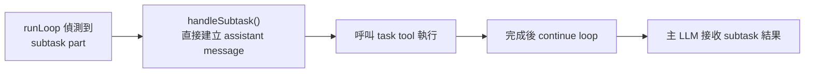

---

## 事件系統與 UI 更新

### Bus 事件流

**關鍵檔案：** `src/bus.ts`, `src/session/processor.ts`

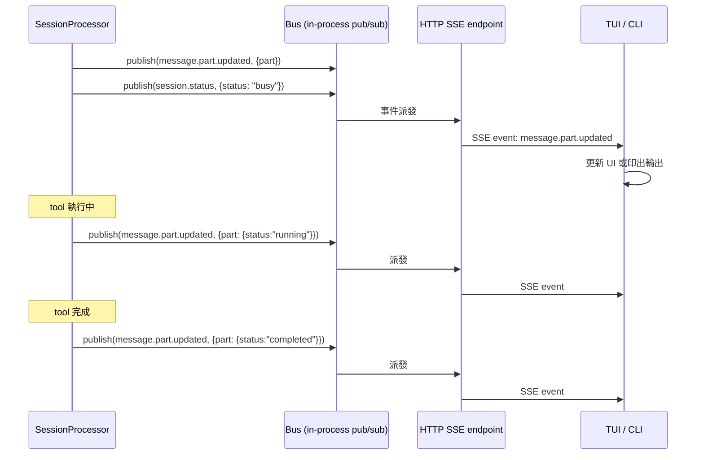

### CLI 的事件處理（`src/cli/cmd/run.ts:449-570`）

```typescript
for await (const event of events.stream) {
  // 文字輸出
  if (event.type === "message.part.updated" && part.type === "text" && part.time?.end) {
    UI.println(part.text)
  }
  // 工具呼叫（顯示圖示 + 標題）
  if (event.type === "message.part.updated" && part.type === "tool" && status === "completed") {
    tool(part) // → bash/glob/grep/read/write/edit/task...
  }
  // session 結束
  if (event.type === "session.status" && status.type === "idle") {
    break // 退出監聽
  }
  // permission 請求（CLI 自動拒絕）
  if (event.type === "permission.asked") {
    await sdk.permission.reply({ requestID: id, reply: "reject" })
  }
}
```

### LLM Stream 事件處理（`src/session/processor.ts:214-455`）

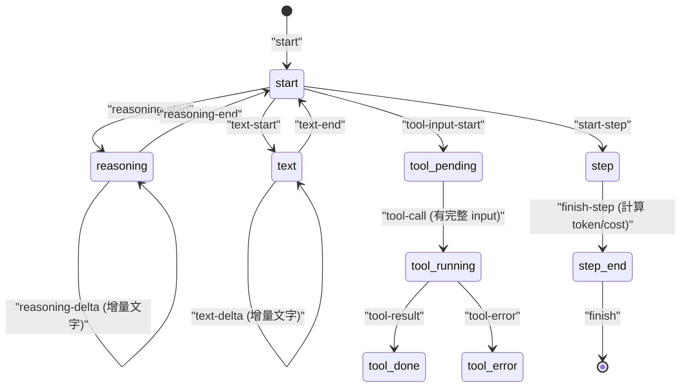

---

## 關鍵檔案索引

| 檔案 | 職責 |
|------|------|
| `src/cli/cmd/tui/thread.ts` | TUI 入口，Worker 代理，SolidJS app 初始化 |
| `src/cli/cmd/run.ts` | CLI `run` 指令，headless 執行模式 |
| `src/session/prompt.ts` | 核心：`SessionPrompt.runLoop`, `createUserMessage`, `resolveTools`, `insertReminders` |
| `src/session/llm.ts` | LLM 呼叫包裝，system prompt 最終組裝，`streamText()` 呼叫 |
| `src/session/processor.ts` | LLM stream 事件處理，tool call 生命週期管理 |
| `src/session/system.ts` | `SystemPrompt.provider()`, `environment()`, `skills()` |
| `src/session/instruction.ts` | AGENTS.md/CLAUDE.md 載入，inline instruction 注入 |
| `src/agent/agent.ts` | Agent 定義（build/plan/general/explore/...），`Agent.generate()` |
| `src/tool/task.ts` | Task tool，建立子 session，multi-agent 協作 |
| `src/session/compaction.ts` | Token 超限時壓縮歷史訊息 |
| `src/server/routes/session.ts` | HTTP API 端點 |
| `src/session/prompt/anthropic.txt` | Anthropic 模型的 base system prompt |
| `src/session/prompt/plan.txt` | Plan 模式的完整工作流程指令 |
| `src/session/prompt/build-switch.txt` | Plan → Build 切換提醒 |
| `src/session/prompt/max-steps.txt` | 步驟上限達到時的提示 |

---

## 附錄：完整 Prompt 結構示意

以 Anthropic Claude + plan 模式為例，送給 LLM 的完整訊息結構：

```
SYSTEM[0]:
  [anthropic.txt base prompt]
  You are OpenCode, the best coding agent...
  # Task Management ...
  # Tool usage policy ...

SYSTEM[1]:  (環境 + skills + instructions 合并)
  You are powered by the model named claude-sonnet-4-6...
  <env>
    Working directory: /home/user/myproject
    Platform: linux
    Today's date: Sun Apr 13 2026
  </env>

  Skills provide specialized instructions...
  [skills 列表]

  Instructions from: /home/user/myproject/AGENTS.md
  [AGENTS.md 內容]

MESSAGES:
  user: [使用者原始訊息 parts]
        + <system-reminder>Plan mode is active... Phase 1..2..3..4..5</system-reminder>

  assistant: [工具呼叫 + 文字輸出...]

  user: [工具結果...]

  ... (歷史對話)
```

**二段式 system prompt 設計目的：**

`llm.ts:127-131` 中有意保持兩段結構，利用 provider 的 **prompt caching**：
- `system[0]`（base prompt）變化少 → 命中 cache
- `system[1]`（環境/skills/instructions）包含動態內容 → 每次稍有不同
